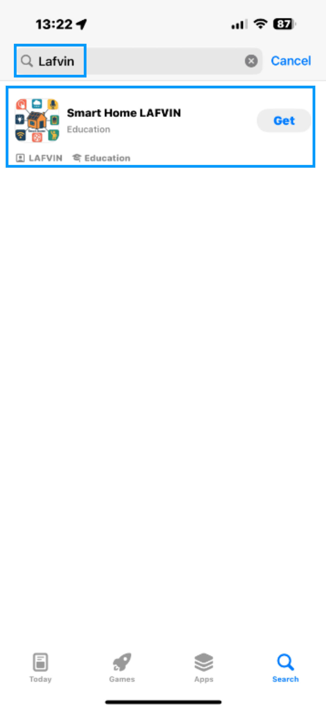
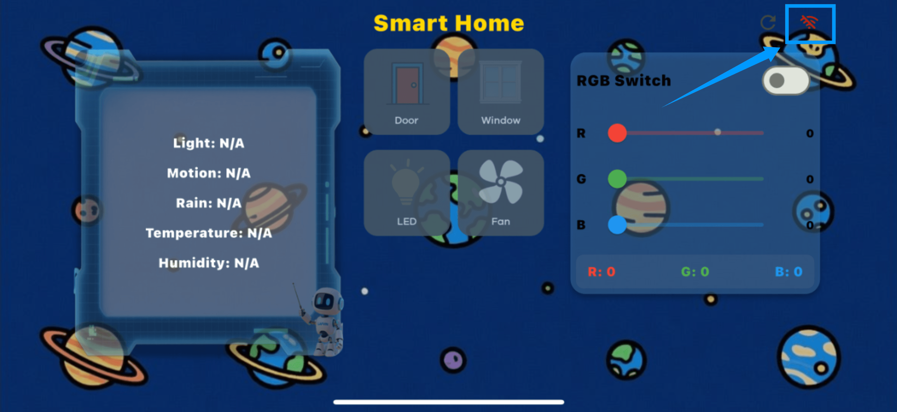
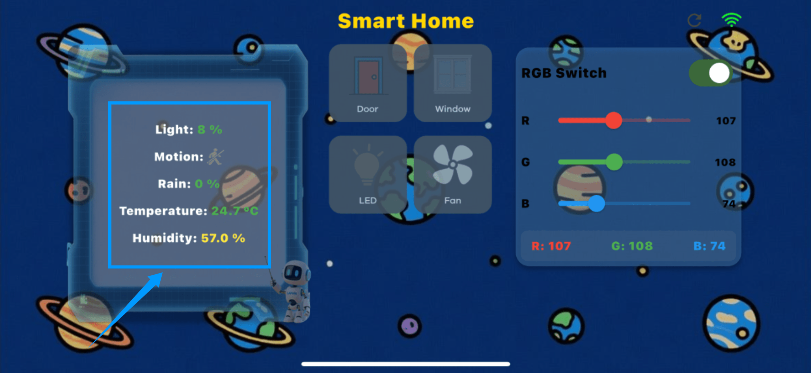
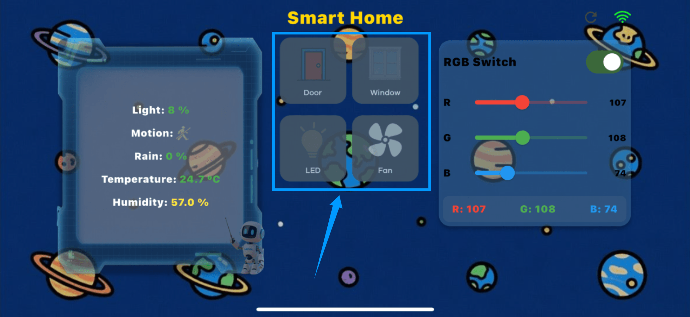
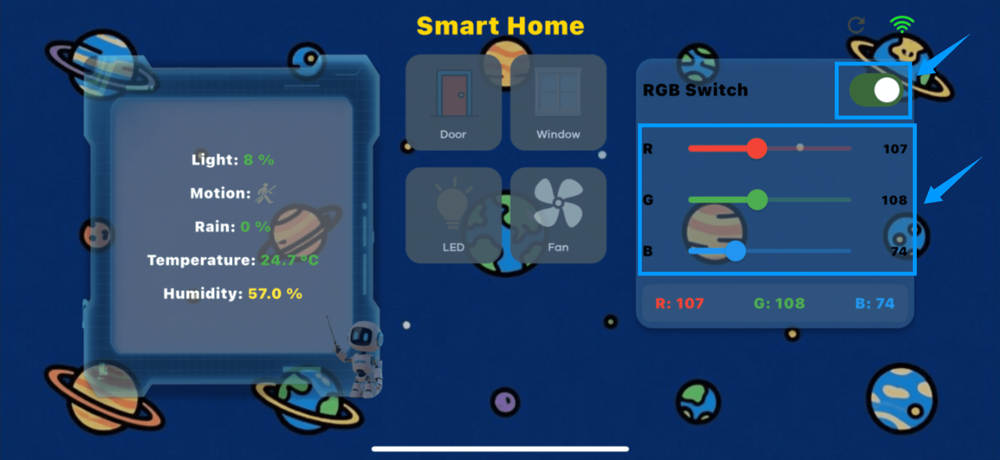

Multiple Control Options
========================

（此处会插入一段功能展示视频）

*This kit integrates multiple interaction methods, enabling automatic control via sensors, remote monitoring and operation via a mobile app, and voice control. These diverse interaction modes make learning and experiencing smart homes more intuitive, convenient, and enriching.*

----

Automatic Control
-----------------

 - When the raindrop sensor detects rain, the servo automatically closes the windows.
 - When the brightness sensor detects a darkening environment and the presence sensor detects a person passing by, the LED automatically illuminates.
 - When the DHT11 temperature and humidity sensor detects excessive temperature, the fan automatically turns on to cool the door.
 - When a button press is detected, the RGB ambient lighting mode switches to different modes, creating a variety of lighting effects.
 - In automatic mode, placing an ID card near the RFID sensor triggers the servo to open the door.

----

App control
------------

**APP Download**

- For Android system, click the link below to download the installation package, or scan the QR code below to download  
  `Android APP Download <https://www.dropbox.com/scl/fi/20e3dp1gob8dso3bxre3a/Smart-Home.apk?rlkey=342yohnc73du0dtbu33l5rux0&st=mbnjjsey&dl=1>`_

- iOS devices can download the app from the App Store. Search for "LAFVIN" to find and install it, or scan the QR code below to jump to the download page.  

.. raw:: html

   

   

----

**APP Usage Guide**

1. Open the downloaded and installed application, the interface is as follows.  

.. image:: _static/53.APP.png
   :width: 600
   :align: center

.. raw:: html

   

   
2. Click the WiFi icon in the upper right corner of the interface, enter the IP address, and then click the "Connect" button to successfully connect the mobile app to the kit.  

.. raw:: html

   

.. image:: _static/54.APP.png
   :width: 600
   :align: center

.. raw:: html

   

.. note::

 1. To ensure the app can successfully connect to the ESP32, please configure the following settings based on the flashing method used:

 **For users flashing the program using the Arduino IDE**

  - You can modify the Wi-Fi name (SSID) and password directly in the code to match your local network information.

  - After flashing, the ESP32 will automatically connect to the designated Wi-Fi network without any additional steps.

 **For users flashing the firmware using Espressif's official flashing tool**

  - You must first configure the Wi-Fi network to complete the network connection.

  - Click here to jump to the network configuration tutorial and follow the steps to complete the connection setup. :ref:`Direct Burn Program`.

 2. The kit's IP address will be displayed on the LCD1602 screen each time the development board is powered on. Because the IP address may change randomly, if your mobile app cannot connect to the kit, first confirm whether the IP address has changed and enter the latest address to connect.
   .. image:: _static/62.IP.png
      :width: 800
      :align: center

   .. raw:: html

    

 3. If you receive a "Connection failed" message when trying to connect to an IP address on iOS, first go to System Settings, find the "Wi-Fi & Cellular Data" permission for the app, and confirm that Internet access is enabled. If not, enable the permission, then return to the app and try connecting again.  

   .. image:: _static/56.APP.jpg
      :width: 600
      :align: center

 4. The ESP32 and the mobile phone must be connected to the same Wi-Fi network to successfully establish a connection with the app.

3. APP Interface Operation Guide

- Once connected, users can control the Smart Cabin Kit through the app. The left side of the interface displays real-time sensor data, including temperature, humidity, brightness, rain levels, and human presence, allowing users to monitor environmental conditions at any time.  

- The middle is the control area. Click different icons to switch on and off the LED lights, fans, doors and windows. The operation is intuitive and convenient.  

- On the right is the RGB atmosphere light control area. In addition to switching preset lighting effects through the button module, you can also manually adjust the RGB values ​​in the APP to customize your favorite colors. However, you must first click the "RGB Switch" button to turn on the light strip before you can adjust the color.  

.. raw:: html

   

----

Speech Recognition control
----------------------------

This kit supports voice recognition, allowing users to directly control LED lights, fans, doors and windows, and adjust the volume through voice commands.  

- Before using voice control, you need to wake up the device.The wake-up phrase is: **"Hi Lumi."** When the device responds, **"Hi, I am Lumi, how can I help you?"** , it has successfully woken up.You can now use the following voice commands to control the device：
- Open the door
- Close the door
- Turn on the light
- Turn off the light
- Open the window
- Close the window
- Turn on the fan
- Turn off the fan
- Turn on the ambient light
- Turn off the ambient light
- Volume up
- Lower the volume

.. note::

   - The system only recognizes the following preset commands. Voice content outside the range will not take effect.

----