Arduino IDE Getting Started Tutorial
====================================

The Arduino IDE is an open-source programming tool officially provided by Arduino, supporting C/C++ development. 

It provides users with simple and intuitive code writing, compiling, and uploading functions, making it easy to burn programs to development boards such as Arduino and ESP32. 

The IDE includes extensive built-in example code and supports library file extensions, allowing developers to quickly access drivers for various sensors and modules, enabling a rich set of hardware interaction features.

With its cross-platform support (Windows, macOS, and Linux), the Arduino IDE is widely used in education, makerspaces, and IoT development, making it an essential tool for both beginners and advanced embedded development learners.

----

1.Install the Arduino IDE
-------------------------

This section will guide you through installing the **Arduino IDE** on Windows, macOS, and Linux systems.  

Install Arduino IDE on Windows
~~~~~~~~~~~~~~~~~~~~~~~~~~~~~~

1. Visit the official Arduino website and go to the software download page:  
   `Arduino IDE Download <https://www.arduino.cc/en/software/>`_

   .. image:: _static/2.arduino_install3.png
      :alt: Arduino IDE official website
      :align: center

2. Select the version that matches your computer configuration, then click the **Download** button to begin.  

.. note::

   - The Arduino IDE is updated frequently. To ensure compatibility, it is recommended to download the **latest official version**.

3. Run the installer by double-clicking the downloaded ``arduino-ide_xxxx.exe`` file.  

4. Read and accept the **License Agreement**.  

   .. image:: _static/3.Install_Arduino_IDE.png
      :alt: License Agreement window
      :align: center

5. Select the desired installation options.  

   .. image:: _static/4.Install_Arduino_IDE.png
      :alt: Installation options
      :align: center

6. Choose the installation path. It is recommended to install the software on a **non-system drive**.  

   .. image:: _static/5.Install_Arduino_IDE.png
      :alt: Installation path
      :align: center

7. Click **Install** and wait for the process to complete. Finally, click **Finish**.  

   .. image:: _static/6.Install_Arduino_IDE.png
      :alt: Installation finished
      :align: center

----

Install Arduino IDE on MacOS
~~~~~~~~~~~~~~~~~~~~~~~~~~~~
1. Double-click the downloaded ``arduino-ide_xxxx.dmg`` file.  

2. Drag and drop **Arduino IDE.app** into the **Applications** folder.  

3. After a few seconds, you will see Arduino IDE installed successfully.  

   .. image:: _static/7.Install_Arduino_IDE.png
      :width: 800
      :alt: Arduino IDE installation on macOS
      :align: center

----

Install Arduino IDE on Linux
~~~~~~~~~~~~~~~~~~~~~~~~~~~~

For Linux users, please follow the official tutorial for Arduino IDE 2.0 installation: `Linux Installation Guide <https://docs.arduino.cc/software/ide-v2/tutorials/getting-started/ide-v2-downloading-and-installing#linux>`_

----

Open the Arduino IDE
~~~~~~~~~~~~~~~~~~~~

When you open Arduino IDE for the first time:  

- The software will automatically install the **Arduino AVR Boards**, built-in libraries, and other required files.  

   .. image:: _static/8.Install_Arduino_IDE.png
      :alt: First startup window
      :align: center

- During installation, your **firewall** or **security center** may ask for permission to install drivers. Please allow all requests.  

   .. image:: _static/9.Install_Arduino_IDE.png
      :alt: Driver installation prompt
      :align: center

.. note::

   - If some installations fail due to network issues, simply **reopen the Arduino IDE** and it will continue the remaining installation steps.  
   - The **Output Window** will not appear automatically after setup. It will only open when you click **Verify** or **Upload**.  

----

.. _install_ch340_driver:

2.Install CH340 Driver
----------------------

The ESP32 development board in this kit uses the **CH340C USB-to-serial chip**, so you must install the corresponding driver before using it.  

If you connect the board to the computer without installing the driver, the device will not be recognized correctly, and you may see the following interface in the **Device Manager**:  

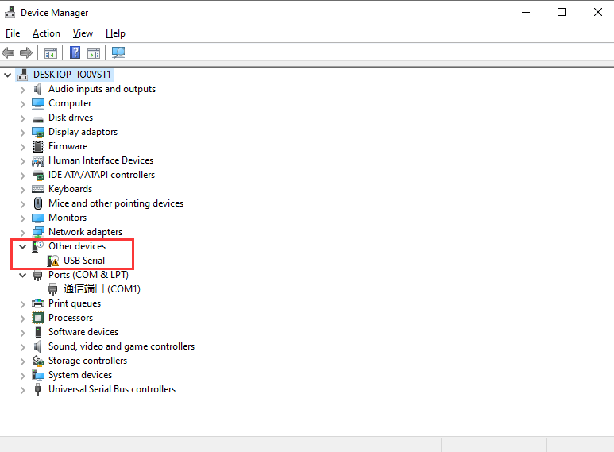

----

Download the Driver
~~~~~~~~~~~~~~~~~~~~

1. Visit the official website of the CH340 Driver: `CH340 Driver <https://www.wch.cn/products/ch340.html>`_  

2. Select the version that matches your computer system.（This tutorial uses **Windows 11** as an example）.

.. raw:: html

   

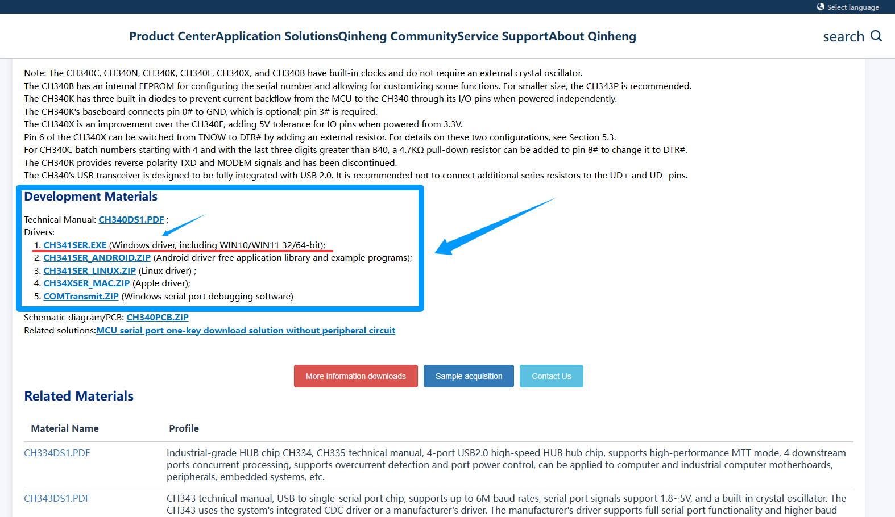

.. raw:: html

   

3. Select the first Windows version, go to the download page, and click the **Download** button.  

.. raw:: html

   

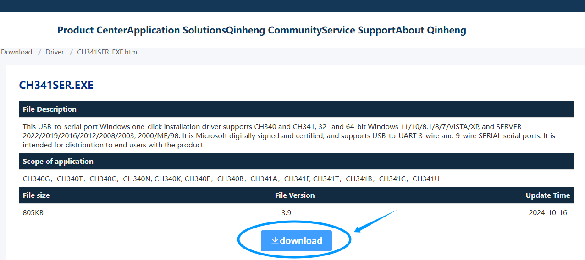

.. raw:: html

   

4. Alternatively, you can download the prepared installation package directly: `CH340 Installation Package (Windows) <https://www.dropbox.com/scl/fo/c4bb59fr42qcs9cxgexan/AIMImtqevecMqYNMJVK1ZBM?rlkey=9afntuwy2usxfxbl7xjkoirsy&st=89a5bx6b&dl=1>`_

----

Install the Driver
~~~~~~~~~~~~~~~~~~~~

1. After downloading, open the driver file and click **Install**.  

.. raw:: html

   

.. image:: _static/13.CH340.png
   :width: 600
   :align: center

.. raw:: html

   

2. When the installation is successful, you will see the following confirmation message:  

.. raw:: html

   

.. image:: _static/14.CH340.png
   :width: 600
   :align: center

.. raw:: html

   

.. note::

   In some cases, you may need to **restart Windows** after installation to ensure the driver takes effect.  

----

Checking Correct Driver Installation in Device Manager
~~~~~~~~~~~~~~~~~~~~~~~~~~~~~~~~~~~~~~~~~~~~~~~~~~~~~~~

Once the driver is installed, connect the ESP32 board to your computer.  

You should see the correct name and port number appear in the **Device Manager** (for example: COM28).  

.. raw:: html

   

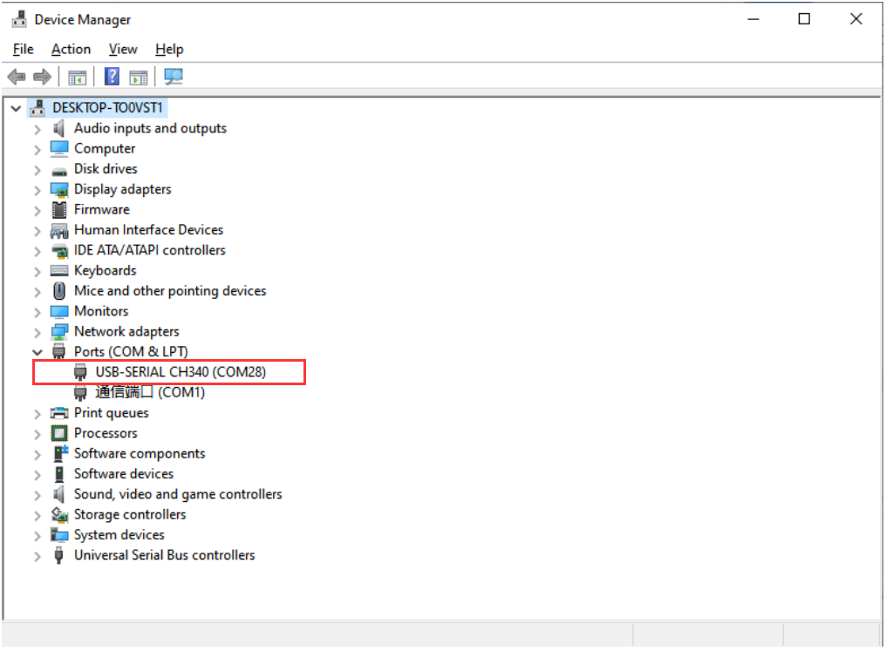

----

Checking Correct Driver Installation in Arduino IDE
~~~~~~~~~~~~~~~~~~~~~~~~~~~~~~~~~~~~~~~~~~~~~~~~~~~

1. Open the Arduino IDE.  

2. Go to **Tools → Port** and select the COMx port that matches the one you saw in Device Manager.  

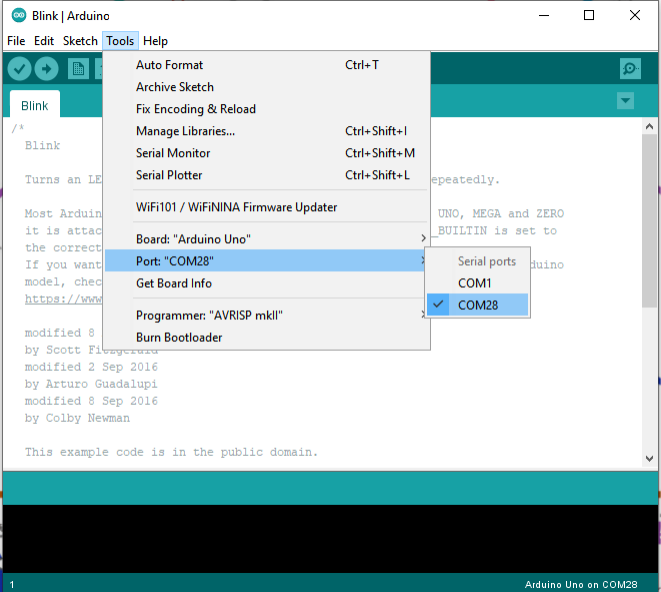

.. raw:: html

   

   
.. note::

   If the Arduino CH340 device does not appear in Device Manager or the Arduino IDE:  
   - Uninstall the driver, restart your computer, then reinstall it.  
     .. image:: _static/17.CH340.png
        :width: 600  
   - Try a different USB port or another computer.  
   - Ensure you are using a **USB cable that supports data transfer** (not just charging).  

----

3.Install The ESP32 Core Board 
-------------------------------

Add Additional Boards Manager URL
~~~~~~~~~~~~~~~~~~~~~~~~~~~~~~~~

1. Open the Arduino IDE, click **File → Preferences** in the upper left corner, and copy and paste the following address into the *Additional Board Manager URLs* input box.  

2. After entering the URL, click **OK**.  

.. raw:: html

   

     <code id="esp32-url" style="background:#f5f5f5;padding:6px 10px;border:1px solid #ddd;border-radius:6px;">https://espressif.github.io/arduino-esp32/package_esp32_index_cn.json</code>
     <button onclick="navigator.clipboard.writeText(document.getElementById('esp32-url').innerText)" style="padding:4px 8px;background:#007bff;color:#fff;border:none;border-radius:4px;cursor:pointer;"> Copy</button>
   

.. raw:: html

   

.. image:: _static/18.URL.png
   :width: 600
   :align: center

.. raw:: html

   

.. image:: _static/19.URL.png
   :width: 600
   :align: center

.. raw:: html

   

.. image:: _static/20.URL.png
   :width: 600
   :align: center

.. raw:: html

   

.. admonition:: Precaution
   :class: note

   - After completing this step, you need to close and reopen the Arduino IDE.

----

Download the  ESP32 Core Package 
~~~~~~~~~~~~~~~~~~~~~~~~~~~~~~~~

1. Open the Arduino IDE, click the second icon on the left to open the **BOARDS MANAGER** page.  

   .. image:: _static/21.ESP32_CORE.png
      :width: 600
      :align: center

.. raw:: html

   

2. Enter **ESP32** in the search box and press Enter.  

3. Find the core package titled *esp32 by Espressif Systems*, select version **3.2.0** from the drop-down menu, and click **Install** to download and install it.  

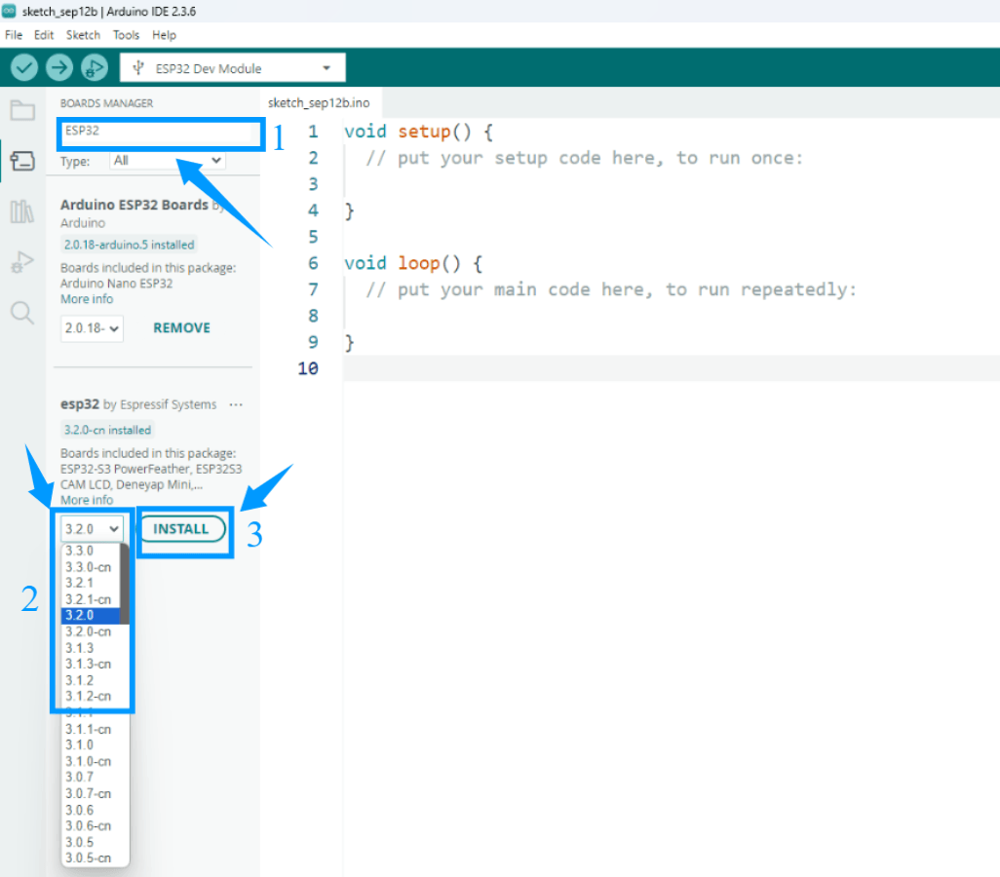

.. raw:: html

   

4. Please wait for the download progress bar in the lower right corner to complete.  

.. raw:: html

   

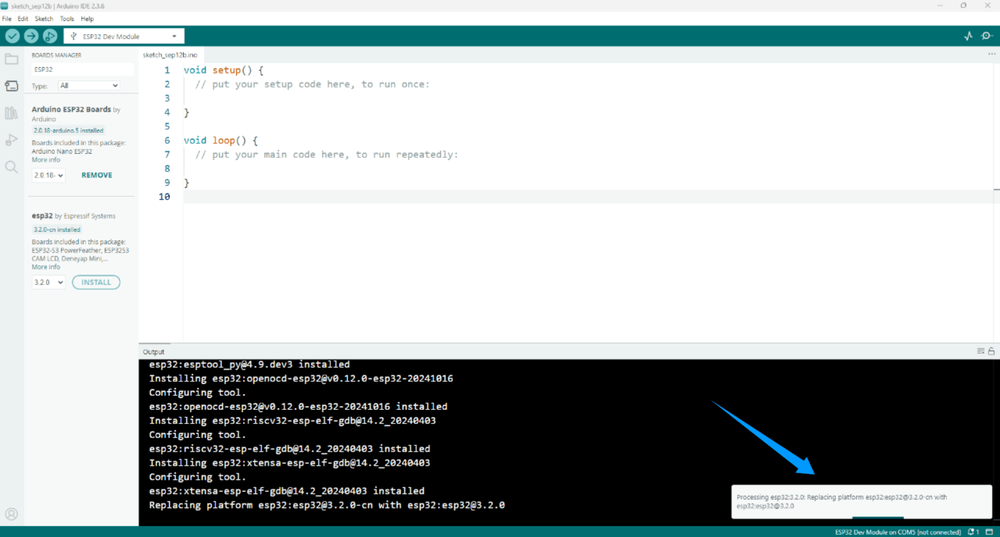

.. raw:: html

   

5. When the download is complete, the message **Successfully installed platform esp32:3.2.0** will be displayed.  

.. raw:: html

   

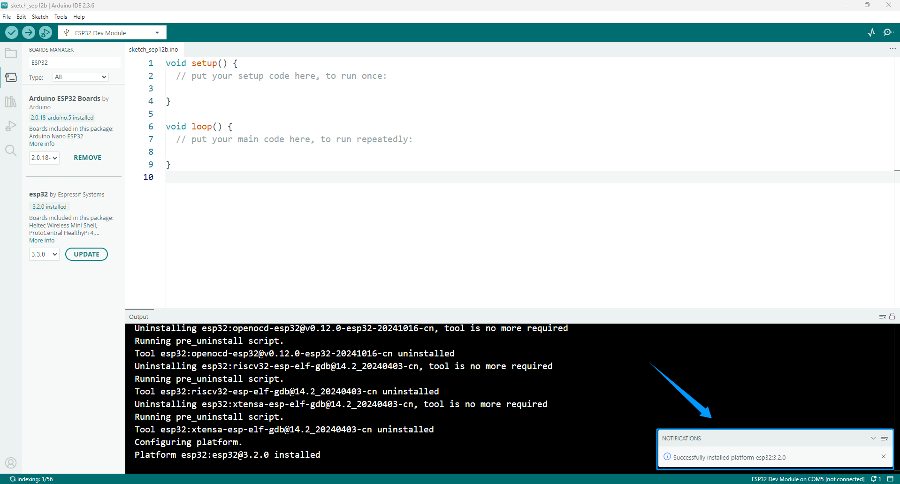

.. raw:: html

   

6. Check if the installation is successful:  
Click **Tools → Board → esp32** to check whether an ESP32 development board is available for selection.  

.. raw:: html

   

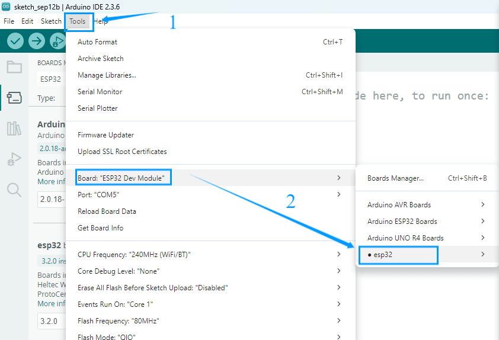

.. raw:: html

   

.. admonition:: Precaution
   :class: note

   - We recommend installing ESP32 Core Package version **3.2.0**, or using version **3.0 or later**.  
   - Older versions may be incompatible with the libraries used in this tutorial, causing program errors.  
   - If you have an earlier version installed, uninstall it and then reinstall version **3.2.0** of the ESP32 Core Package.  

----

4.Add Libraries
---------------

- Arduino libraries can significantly simplify the development process.  
- They encapsulate commonly used functions and hardware driver code, allowing users to simply call ready-made functions without writing complex low-level code from scratch.  
- For example, the **LiquidCrystal_I2C** library allows users to drive an LCD1602 display with just a few lines of code.  
- A wealth of community-provided third-party libraries also allows for quick integration with various sensors and modules.  
- These library functions make it easy to interact with hardware and expand Arduino's functionality.

----

Download Libraries
~~~~~~~~~~~~~~~~~~

1. We've compiled all the libraries necessary to run this suite. Please click the link below to download them and follow the instructions to complete the installation:  `Download libraries <https://www.dropbox.com/scl/fo/syf1zstu58f4xlcld2nss/ACJOi93PcIafo5yGabrprDA?rlkey=hoc2undykymrxac7z8nclpk9u&st=el86zaw9&dl=1>`_

2. Unzip the downloaded library file. The library file storage path is **Code and Libraries** → **Libraries** . Open it and confirm that it contains the library file shown in the figure below. 

.. raw:: html

   

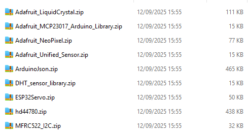

----

Import Libraries
~~~~~~~~~~~~~~~~

1. Open the Arduino IDE and click **Sketch → Include Library → Add .ZIP Library**.  

.. raw:: html

   

.. image:: _static/27.lib.png
   :width: 600
   :align: center

.. raw:: html

   

2. In the pop-up window, locate the folder of the library you just downloaded and unzipped, select it, and click **Open** to complete the import.  

.. raw:: html

   

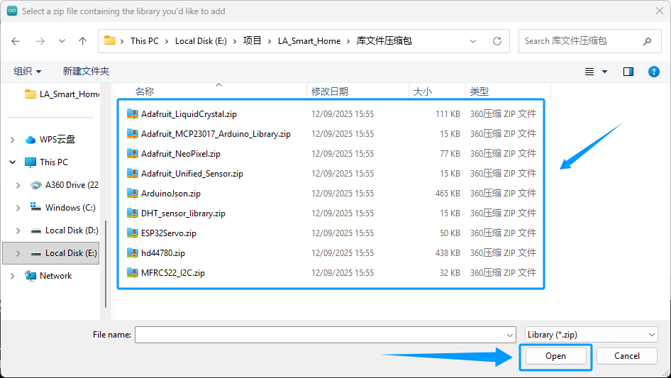

.. raw:: html

   

3. If the library file is imported successfully, the Arduino IDE output window will display the message: *Library installed*.  

.. raw:: html

   

.. image:: _static/31.lib.png
   :width: 600
   :align: center

.. raw:: html

   

.. admonition:: Precaution
   :class: note

   - Arduino IDE does not support importing multiple libraries at once; you must import one library at a time.  
   - If a library file already exists, a prompt will appear asking whether to overwrite it. It is recommended to confirm overwrite to avoid program errors caused by different library versions.  

.. image:: _static/29.lib.png
   :width: 600
   :align: center

4. Verify that the library was imported successfully:  
   Click **Sketch → Include Library**, scroll down to **Contributed Libraries**, and check whether the library files we provided are listed.  

   .. image:: _static/30.lib.png
      :width: 600
      :align: center

----

Download Libraries Using Arduino IDE
~~~~~~~~~~~~~~~~~~~~~~~~~~~~~~~~~~~~

You can also download required libraries directly using the Arduino IDE.  

1. On the right side of the Arduino IDE interface, click the **Library Manager** icon.  
2. Enter keywords in the search box to find the required library and click **Install** to download.  

.. image:: _static/32.lib.png
   :width: 600
   :align: center

.. raw:: html

   

----

