Smart Home Assembly Tutorial
============================

.. figure:: _static/1/1.SmartHome.png
   :alt: The effect picture of the cabin installation
   :align: center

   （Design sketch of smart house installation）

Installation video tutorial
---------------------------
（此处会插入一段安装的视频教程）

----

Wiring
---------

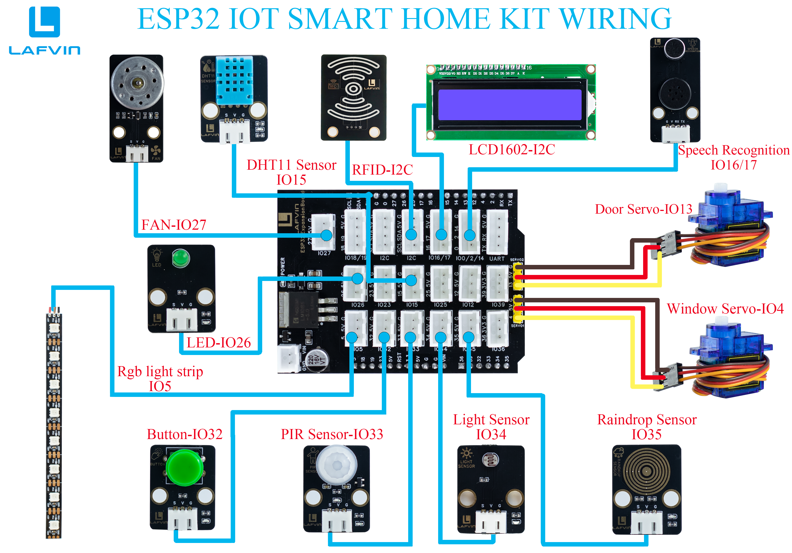

.. raw:: html

   

.. list-table::
   :header-rows: 1
   :widths: 50 20
   :align: center

   * - Component
     - ESP32 Pin
   * - Window Servo
     - 4
   * - Door Servo
     - 13
   * - Fan
     - 27
   * - PIR Sensor
     - 33
   * - LED
     - 26
   * - Light Sensor
     - 34
   * - Button
     - 32
   * - DHT11 Sensor
     - 15
   * - Raindrop Sensor
     - 35
   * - Speech Recognition
     - 16, 17
   * - RFID
     - I2C-SCL, SDA
   * - LCD1602
     - I2C-SCL, SDA
   * - RGB Light Strip
     - 5

----

 - With the exception of the servos, all sensors and components in the system utilize standard XH2.54 (3/4-pin) connectors with reverse polarity protection, ensuring plug-and-play operation without requiring polarity identification.
 - When connecting the servos, please follow the cable colors shown in the following diagram.

 .. image:: _static/1/54.servo.png
   :width: 600
   :align: center

----

Screw size comparison
---------------------

 - This product requires several different screw types during installation. Before installation, please verify each screw type and follow the instructions in this tutorial to use the specified screw type.
 - Mixing or substituting screw types is strictly prohibited. This may cause installation failure or damage to the product due to screw mismatches. If you are unable to identify the screw type, please discontinue operation and refer to the accessories list or contact customer service for confirmation.

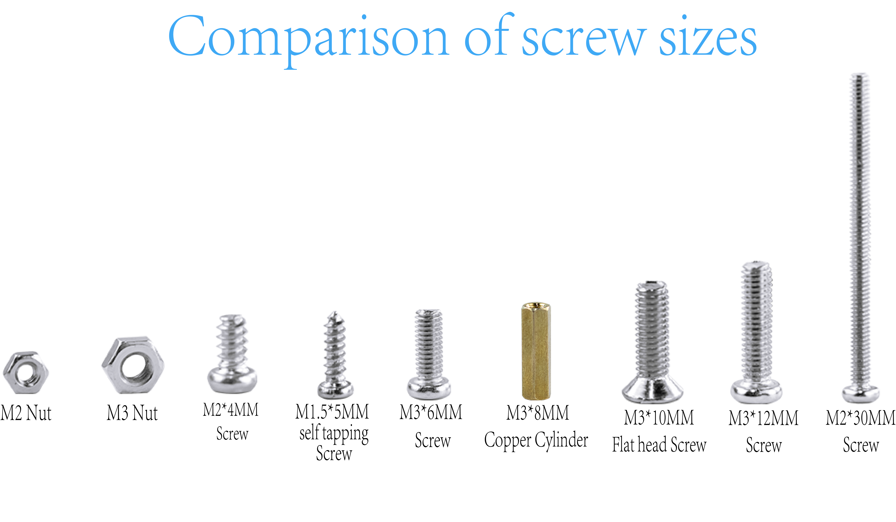

*Now, please follow the steps in this tutorial and let’s start installing the "Smart-Home".*

----

1.Installation of base part
--------------------------

Step 1: Install the ESP32 development board
~~~~~~~~~~~~~~~~~~~~~~~~~~~~~~~~~~~~~~~~~~~

Parts list: Basswood board with "A"、 ESP32 development board、 M3*6mm screw (8 PCS)、 M3*10mm copper pillar (4 PCS).

The installation is shown in the following figure:

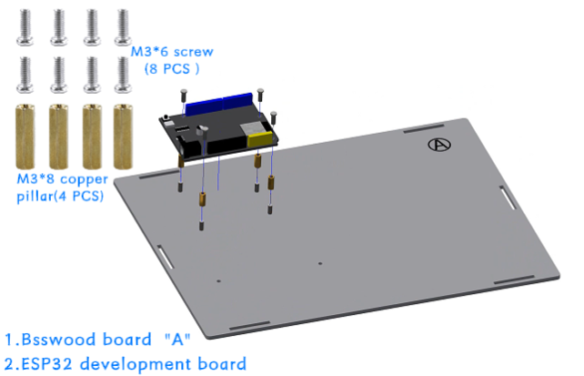

.. raw:: html

   

.. admonition:: Precautions

 - First, insert the screws through the underside of the basswood board numbered "A," then place the copper standoffs and tighten them. Next, place the ESP32 development board and tighten the screws to secure it.
 - The serial numbers on the basswood boards are used only to distinguish one board from another. In the tutorial examples, the serial numbers face outward for ease of illustration, but they should face inward during installation. This principle should also be followed for subsequent basswood installations.

Step 2: Install the battery box
~~~~~~~~~~~~~~~~~~~~~~~~~~~~~~~

Parts list: battery box、 M3*10mm flat head screw (2 PCS)、 M3 nut (2 PCS).

The installation is shown in the following figure:

.. image:: _static/1/4.Battery.png
   :alt: Battery box installation
   :align: center
 

.. admonition:: Precautions

 - When securing the battery compartment, use flat-head screws. If you use round-head screws, the screws will protrude and press against the battery, preventing it from being installed properly.

Step 3: Install the base
~~~~~~~~~~~~~~~~~~~~~~~~

Parts list: Basswood boards with "B, C, D, E, F"、 blue latch (6 PCS).

The installation is shown in the following figure:

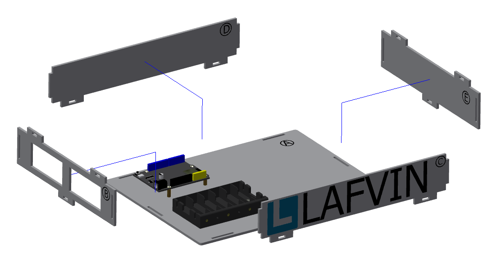

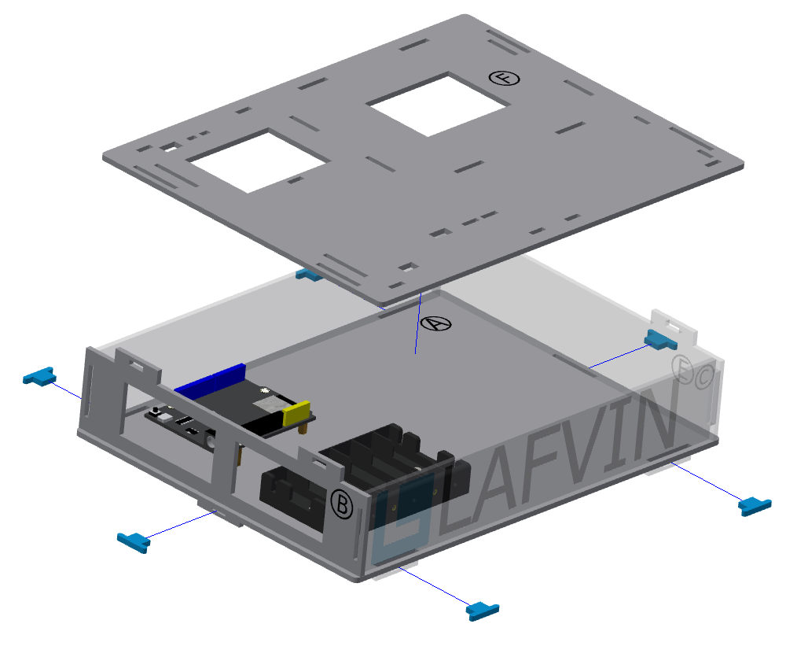
 

.. admonition:: Precautions

 - The order in which basswood boards with "B, C, D, E" can be installed is not restricted, but basswood board "F" must be installed after them.
 - In this step, only the six bottom latches need to be installed. The latches connected to the basswood board "F" do not need to be installed yet.

The effect of the base installation is shown in the figure:

.. image:: _static/1/7.Base_completed.png
   :alt: 底座安装
   :align: center

----

2.Installation of the first floor
-------------------------------

Step 1: Install the button module
~~~~~~~~~~~~~~~~~~~~~~~~~~~~~~~

Parts list: Basswood board with "G"、 button module、 M3*12mm screw (2 PCS)、 M3 nut (2 PCS).

The installation is shown in the following figure:

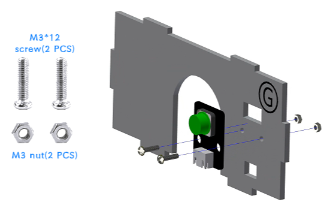

Step 2: Install LCD screen
~~~~~~~~~~~~~~~~~~~~~~~~~~~~~~~

Parts list: Basswood board with "H"、 LCD screen、 M3*12mm screw (4 PCS)、 M3 nut (4 PCS).

The installation is shown in the following figure:

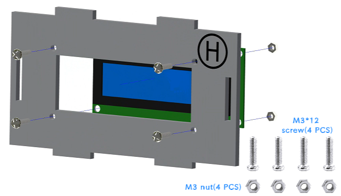

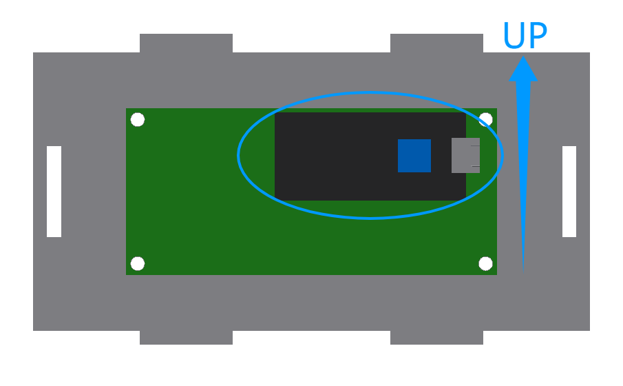

.. admonition:: Precautions

 - When installing the screen, please make sure that the black panel with the socket is facing upwards to prevent the screen from being displayed upside down due to incorrect installation direction.

Step 3: First floor assembly
~~~~~~~~~~~~~~~~~~~~~~~~~~~~

Parts list: Basswood boards with "J, K, L", and "G, H" with screen and buttons installed.

The installation is shown in the following figure:

.. image:: _static/1/11.floor1_1.png
   :alt: floor1_1
   :align: center

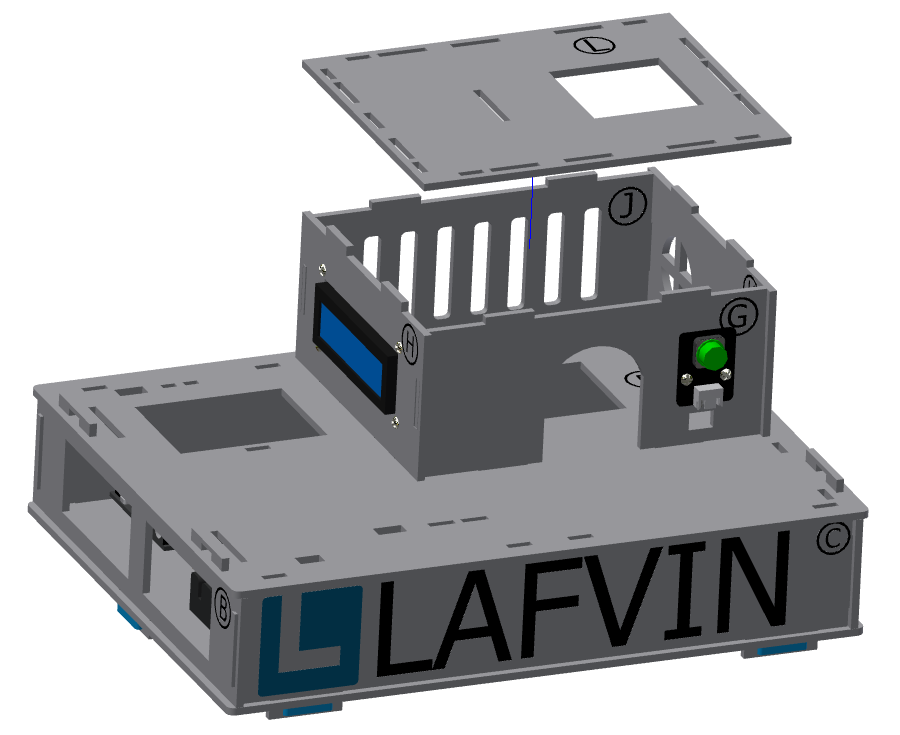
 

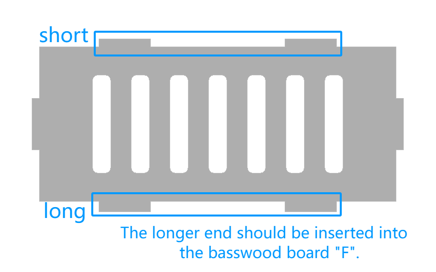

.. admonition:: Precautions

 - Basswood boards with "G, H, J, K" have different protrusion lengths at the top and bottom. To ensure a secure fit, the longer protruding end should be inserted into the "F" board.

The effect of the first floor installation of the cabin is shown in the figure:

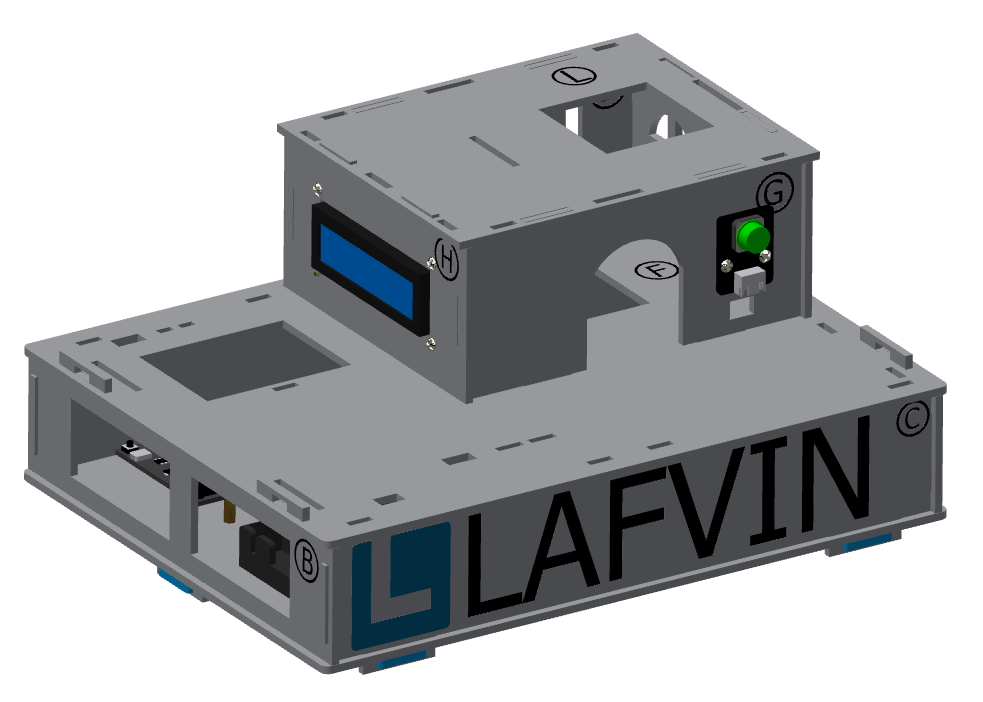

----

3.Installation of the second floor
--------------------------------

Step 1: Install window 
~~~~~~~~~~~~~~~~~~~~~~~~~~~

Step 1-1: Install of gear and swing arm
^^^^^^^^^^^^^^^^^^^^^^^^^^^^^^^^^^^^^^^^^^^^
Parts list: acrylic gear、 servo bag (one-way swing arm)、 M1.5*5mm self-tapping screw (1 PCS).

The installation is shown in the following figure:

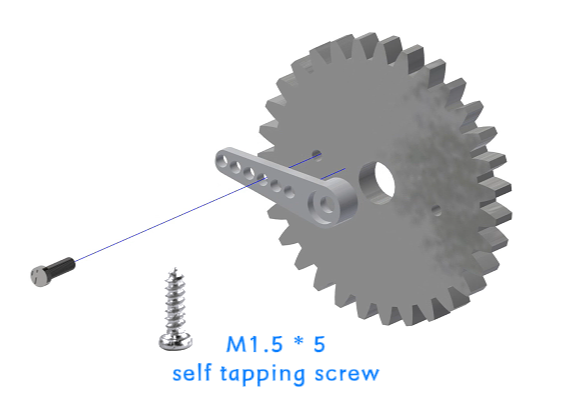

.. admonition:: Precautions

 - Align the small hole of the gear (either left or right) with the third small hole of the swing arm, then install it and tighten the screws.
 - The gear installation method in this step is the same as the subsequent gate control gear installation steps and parts used, so you can complete the installation in this step.

Step 1-2: Install the window servo on the basswood board
^^^^^^^^^^^^^^^^^^^^^^^^^^^^^^^^^^^^^^^^^^^^^^^^^^^^^^^^^
Parts list: Basswood board with "P"、 servo bag (servo)、 M2*30mm screw (2 PCS)、 M2 nut (2 PCS).

The installation is shown in the following figure:

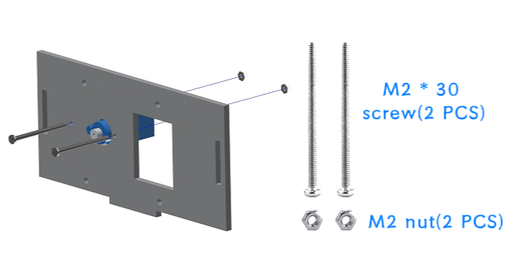

Step 1-3: Install the window gear and acrylic plate onto the basswood board
^^^^^^^^^^^^^^^^^^^^^^^^^^^^^^^^^^^^^^^^^^^^^^^^^^^^^^^^^^^^^^^^^^^^^^^^^^
Parts list: Basswood board with "P"、 window acrylic driver board (shorter acrylic)、 assembled gear、 servo package (shortest screw - M2*4mm)、 M3*12mm screw (4 PCS)、 M3 nut (4 PCS)、Gasket (4 PCS).

The installation is shown in the following figure:

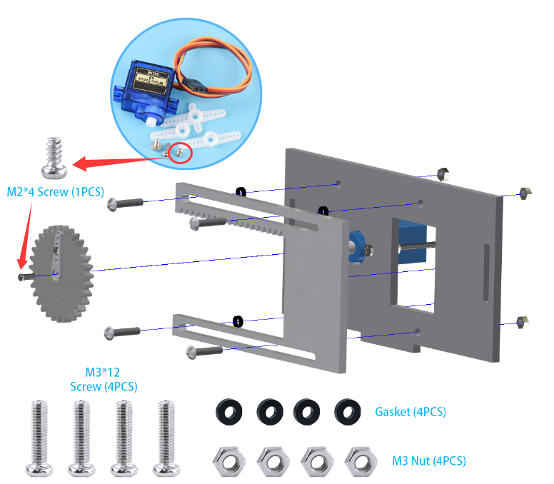

.. raw:: html

   

.. admonition:: Precautions

 - There is a film on both sides of the acrylic, please tear it off before installation.
 - When installing the acrylic window drive plate to the basswood board, the fixing screws do not need to be tightened too much, and appropriate margin should be left to ensure smooth sliding of the window.
 - The window's acrylic drive plate should be installed with the rack facing upwards.

Window installation completed effect picture:

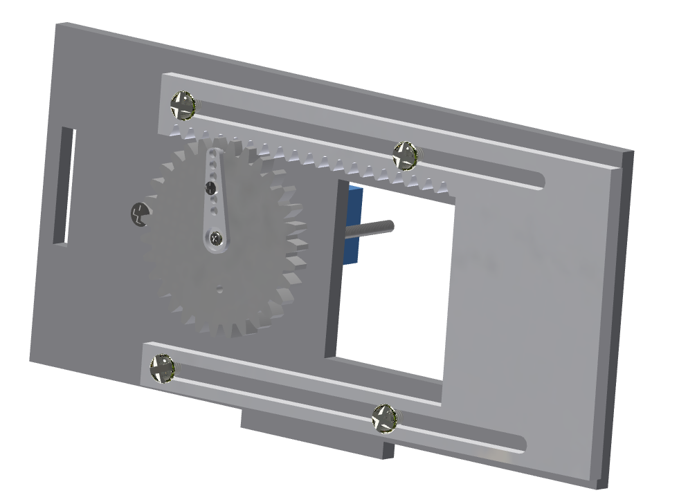

----

Step 2: Install of the Motor Fan
~~~~~~~~~~~~~~~~~~~~~~~~~~~~~~~~
Parts list: Basswood board with  "N"、 motor fan module、 M3*12mm screw (2 PCS)、 M3 nut (2 PCS).

Window installation completed effect picture:

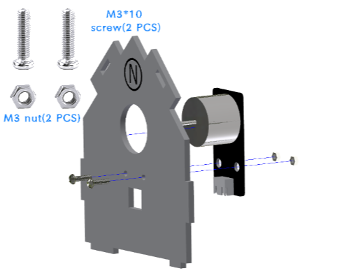

Step 3: Install the Solar Charging Panel
~~~~~~~~~~~~~~~~~~~~~~~~~~~~~~~~~~~~~~~~
Parts list: Basswood board with "R"、 solar charging panel、 solar charging indicator light、 glue.

The installation is shown in the following figure:

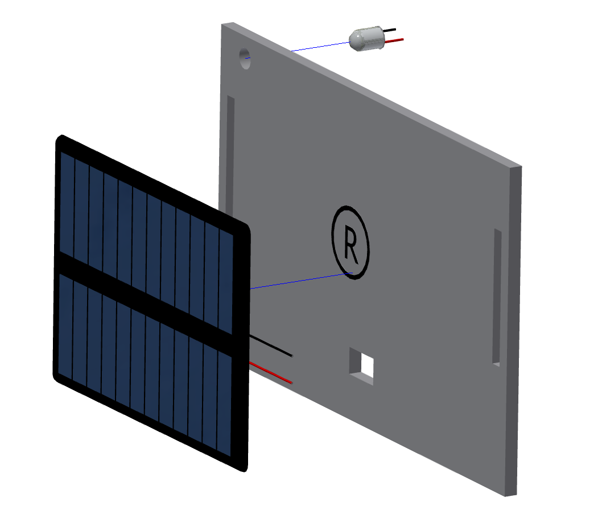

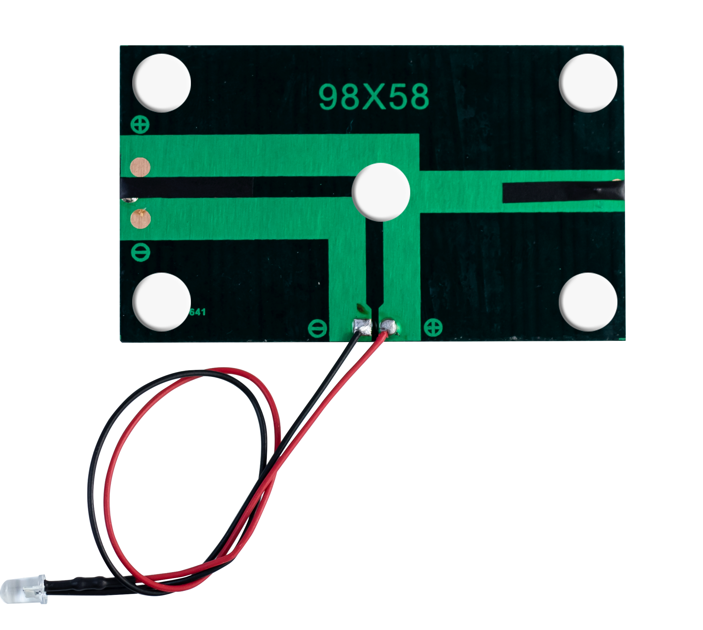

.. raw:: html

   

.. admonition:: Precautions

 - The back of the solar panel is fixed to the wooden board with glue. It is more secure if it is glued in the position shown in the picture above.

Step 4: Install of the Sensor Module
~~~~~~~~~~~~~~~~~~~~~~~~~~~~~~~~~~~~
Parts list: Basswood board with "S"、 DHT11 temperature and humidity sensor、 human infrared sensor、 light-sensitive brightness sensor、 raindrop sensor、 M3*12mm screw (8 PCS)、 M3 nut (8 PCS).

The installation is shown in the following figure:

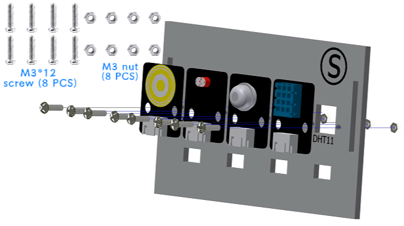

.. admonition:: Precautions

 - Please fix the sensor in the recommended position according to the text marked on the basswood to ensure a stable and balanced installation.

Step 5: Second floor assembly
~~~~~~~~~~~~~~~~~~~~~~~~~~~~~

Parts list: Basswood boards with  "M、 Q", and "N、 P" basswood boards with components installed.

The installation is shown in the following figure:

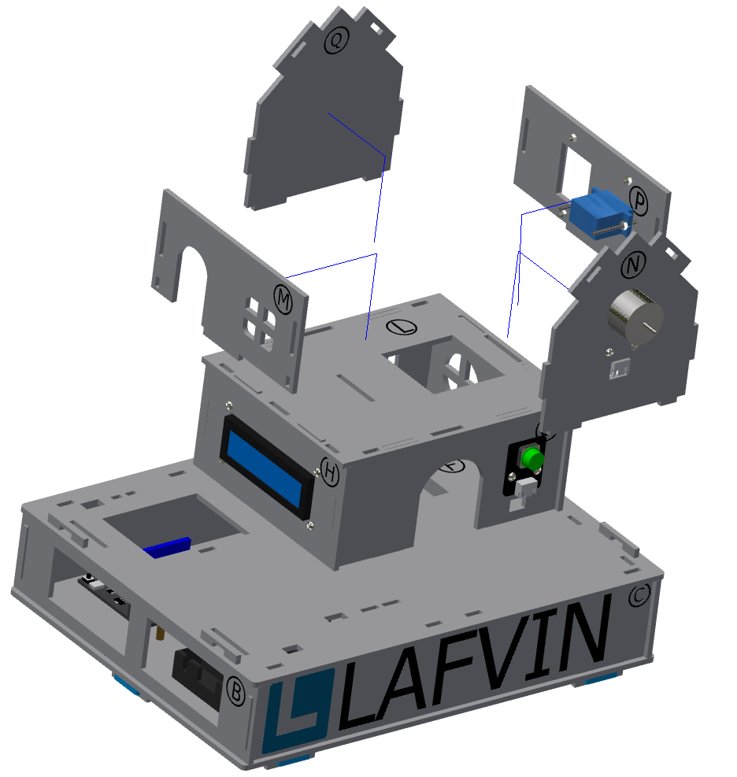

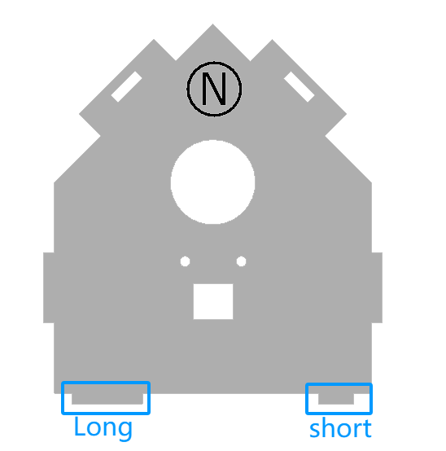

.. admonition:: Precautions

 - The lengths of the protrusions on the left and right sides of the lower ends of the basswood boards with "N, Q" are different. Please carefully distinguish the directions before installing to ensure a stable structure.
 
Step 6: Install roof
~~~~~~~~~~~~~~~~~~~~

Parts List: "S、 R" basswood board with components installed.

The installation is shown in the following figure:

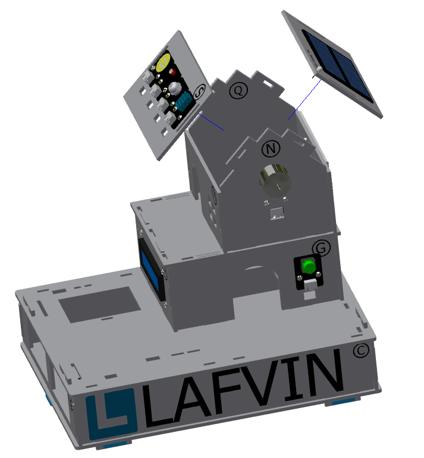

.. raw:: html

   

Step 7: Install of the Second Fence
~~~~~~~~~~~~~~~~~~~~~~~~~~~~~~~~~~~

Parts List: Brown basswood fence planks (shorter, 3 PCS).

The installation is shown in the following figure:

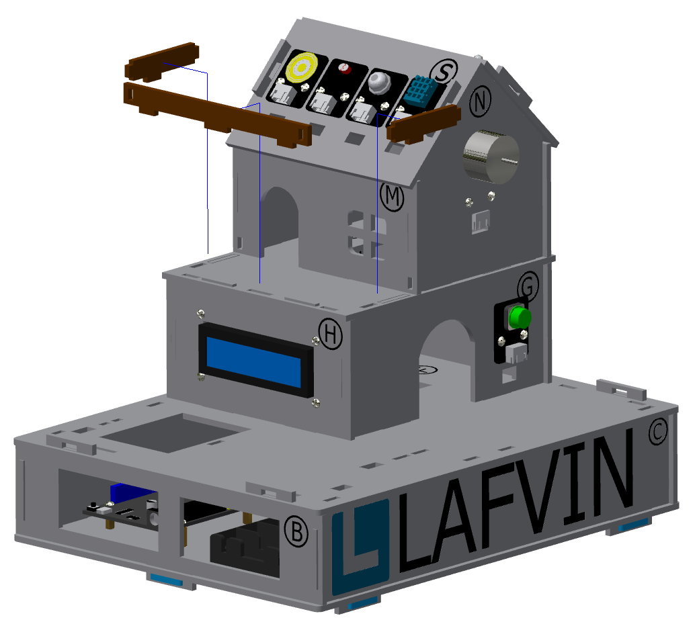

The effect picture of the second floor of the cabin after installation:

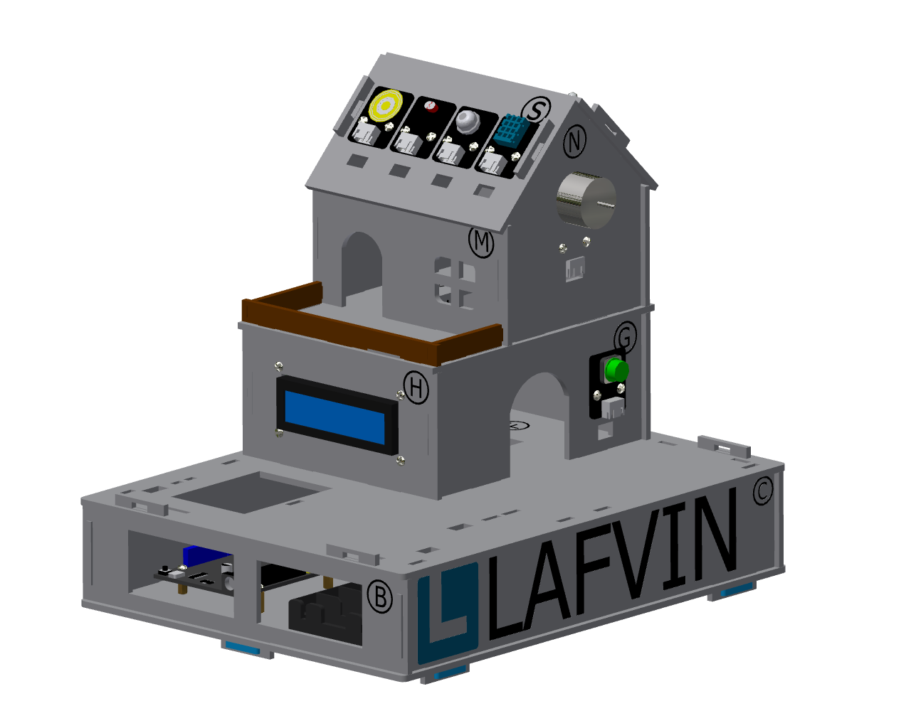

----

4.Installation of  the garden
---------------------------

Step 1: Install of the gate
~~~~~~~~~~~~~~~~~~~~~~~~~~~~~~~~~

Step 1-1: Install of gear and swing arm
^^^^^^^^^^^^^^^^^^^^^^^^^^^^^^^^^^^^^^^^^^^^
Parts list: acrylic gear、 servo bag (one-way swing arm)、 M1.5*5mm self-tapping screw (1 PCS).

The installation is shown in the following figure:

.. admonition:: Precautions

 - Align the small hole of the gear (either left or right) with the third small hole of the swing arm, then install it and tighten the screws.
 - The gear installation method here is the same as the window control gear installation steps and parts. If the previous installation has been completed, this step can be ignored.

Step 1-2: Install the gate servo on the basswood board
^^^^^^^^^^^^^^^^^^^^^^^^^^^^^^^^^^^^^^^^^^^^^^^^^^^^^^
Parts list: Basswood board with "T"、 servo bag (servo)、 M2*30mm screw (2 PCS)、 M2 nut (2 PCS).

The installation is shown in the following figure:

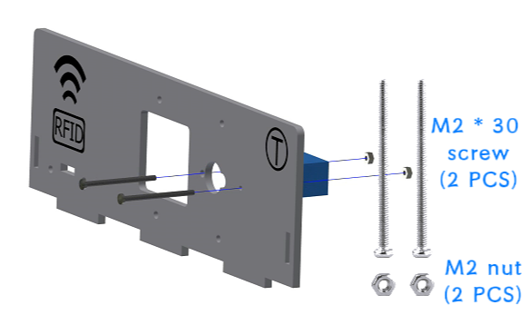

.. raw:: html

   

Step 1-3: Install the gate gear and acrylic plate onto the basswood board
^^^^^^^^^^^^^^^^^^^^^^^^^^^^^^^^^^^^^^^^^^^^^^^^^^^^^^^^^^^^^^^^^^^^^^^^^^
Parts list: Basswood board with "T"、 gate acrylic driver board (shorter acrylic)、 assembled gear、 servo package (shortest screw - M2*4mm)、 M3*12mm screw (4 PCS)、 M3 nut (4 PCS)、Gasket (4 PCS).

The installation is shown in the following figure:

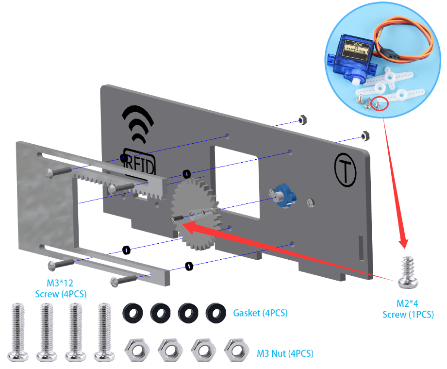

.. raw:: html

   

.. admonition:: Precautions

 - There is a film on both sides of the acrylic, please tear it off before installation.
 - When installing the acrylic gate drive plate to the basswood board, the fixing screws do not need to be tightened too much, and appropriate margin should be left to ensure smooth sliding of the window.
 - The gate's acrylic drive plate should be installed with the rack facing upwards.

Step 1-4: Install of RFID sensor module
^^^^^^^^^^^^^^^^^^^^^^^^^^^^^^^^^^^^^^^^^^^^
Parts list: Acrylic door drive board and basswood board "T" with servo installed、 RFID sensor module、 M3*12mm screw (2 PCS)、 M3 nut (2 PCS).

The installation is shown in the following figure:

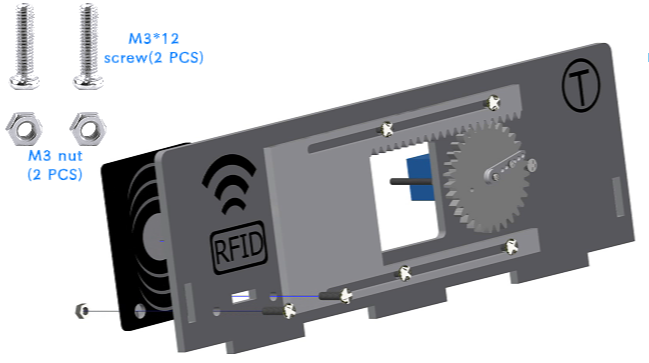

.. raw:: html

   

The effect picture of the gate installation is completed:

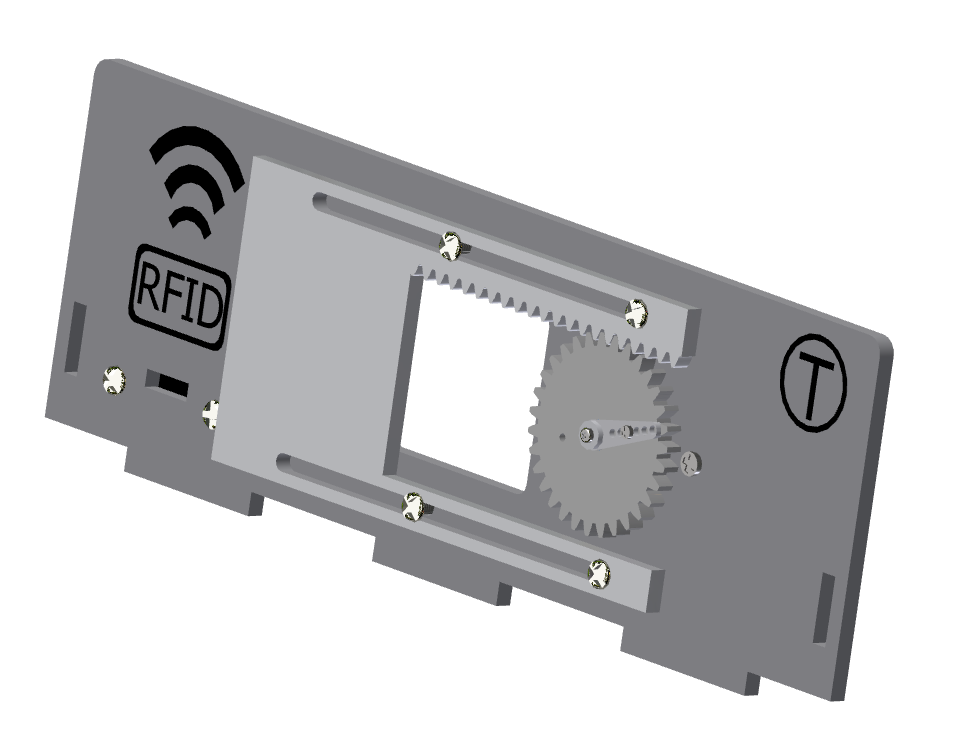

Steps 1-5: Install the gate to the garden
^^^^^^^^^^^^^^^^^^^^^^^^^^^^^^^^^^^^^^^^^^^^
Parts List: Installed servos、 RFID sensor module、 and acrylic basswood board "T".

The installation is shown in the following figure:

.. image:: _static/1/32.door2.png
   :alt: gate
   :align: center

----

.. raw:: html

   

Step 2: Install the speech recognition module
~~~~~~~~~~~~~~~~~~~~~~~~~~~~~~~~~~~~~~~~~~~~~~
Parts list: speech recognition module、 green basswood board、 M3*12mm screw (2 PCS)、 M3 nut (2 PCS).

The installation is shown in the following figure:

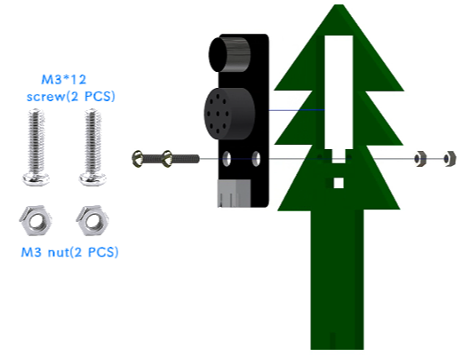

Step 3: Install of LED Light Module
~~~~~~~~~~~~~~~~~~~~~~~~~~~~~~~~~~~~~~~~
Parts list: LED light module、 pink basswood board、 M3*12mm screw (2 PCS)、 M3 nut (2 PCS).

The installation is shown in the following figure:

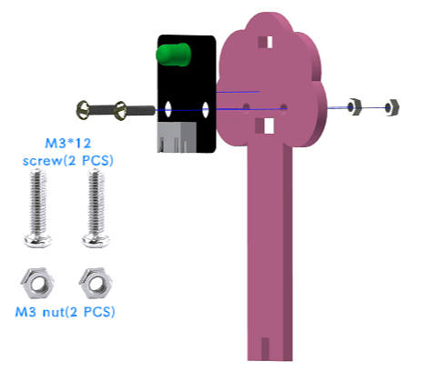

Step 4: Install flowers and trees in the garden
~~~~~~~~~~~~~~~~~~~~~~~~~~~~~~~~~~~~~~~~~~~~~~~~~~
Parts list: Green linden wood board with voice recognition module installed、 pink linden wood board with LED light module installed.

The installation is shown in the following figure:

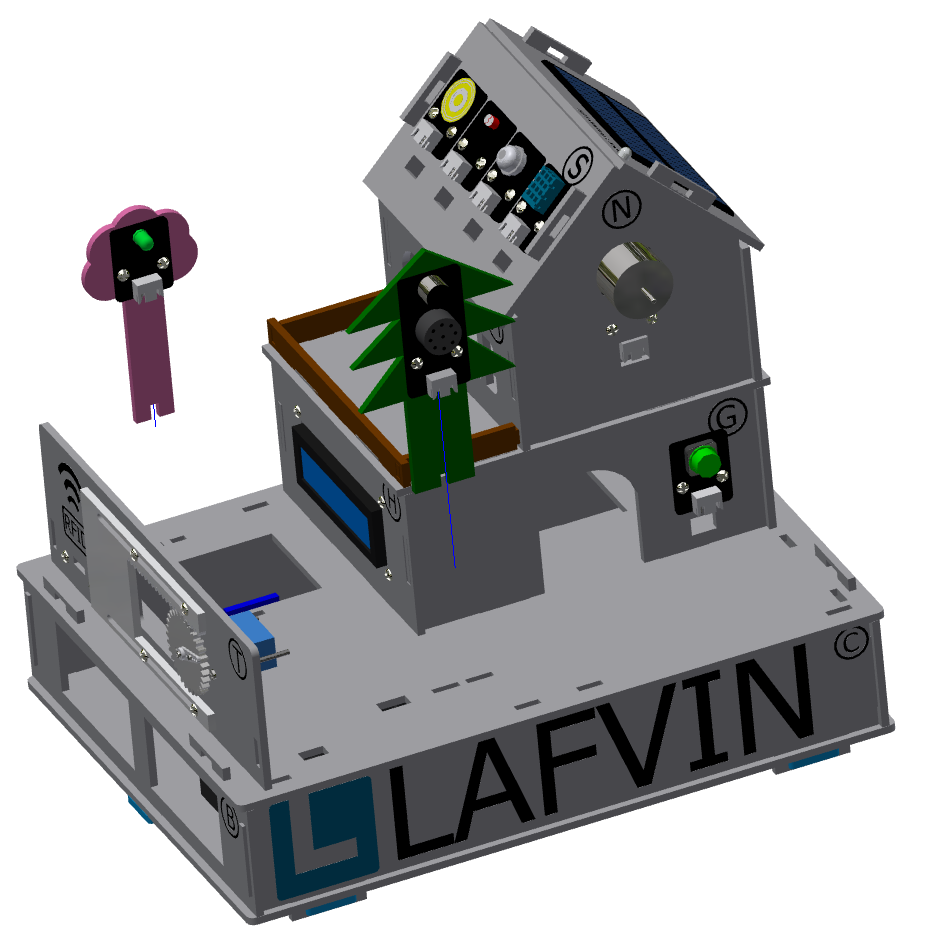

.. raw:: html

   

   
Step 5: Install the RGB Light Strip
~~~~~~~~~~~~~~~~~~~~~~~~~~~~~~~~~~~~~~
Parts list: RGB light strip、 brown basswood fence board (The longest fence).

The installation is shown in the following figure:

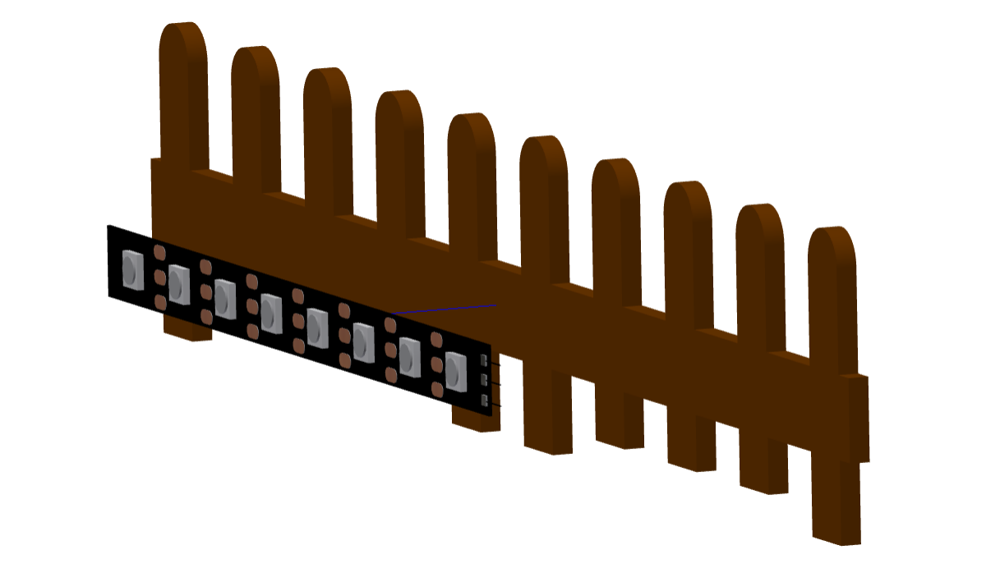

.. admonition:: Precautions

 - First tear off the blue tape on the back of the light strip, and then stick the light strip on the back of the fence.
 - To achieve the best lighting effect, please stick the RGB light strip in the center of the back of the fence.

Step 6: Install of the Garden Fence
~~~~~~~~~~~~~~~~~~~~~~~~~~~~~~~~~~~~~~
Parts list: Brown garden fence basswood planks (2 shorter ones)、 fence with RGB light strip installed.

The installation is shown in the following figure:

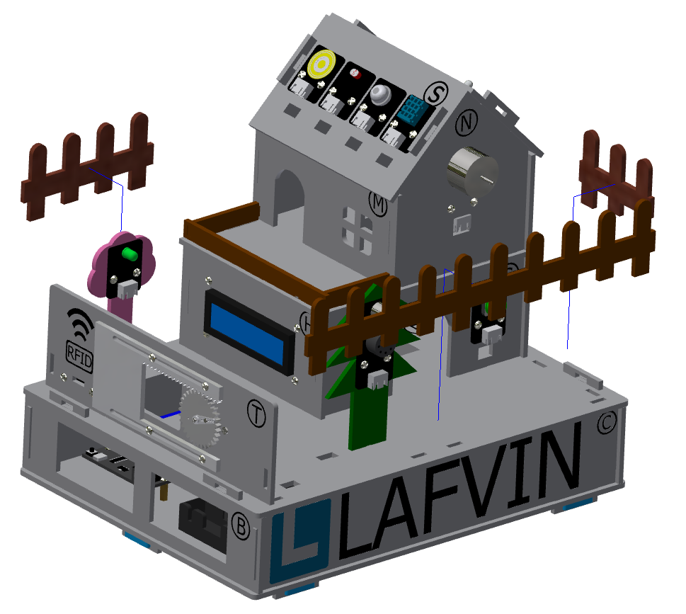

.. admonition:: Precautions

 - Please distinguish between the short and long fences. The longer one should be installed next to the gate, and the shorter one should be installed next to the key module.

----

5.Installation of the fixed part of the cabin
--------------------------------------------

Step 1: Attach the base
~~~~~~~~~~~~~~~~~~~~~~~
Parts List: Blue latch (8 PCS).

The installation is shown in the following figure:

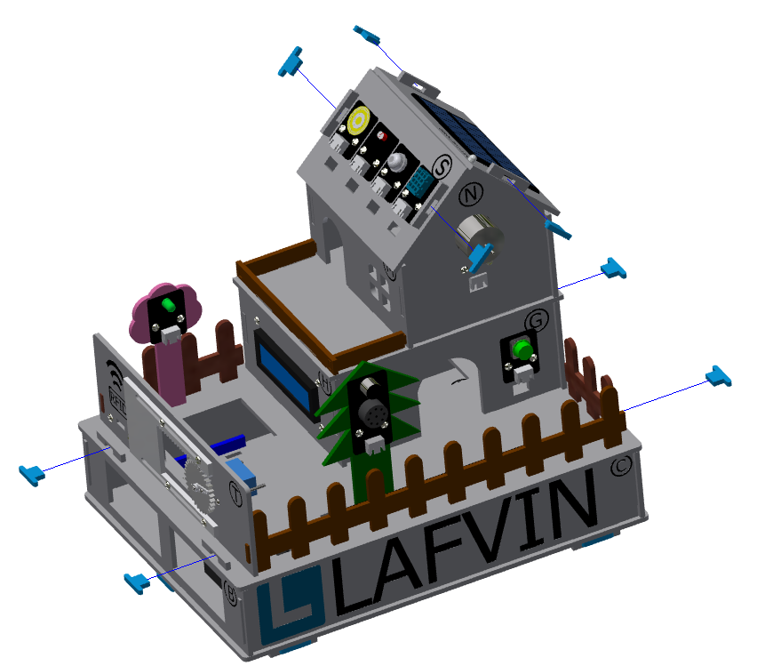

.. raw:: html

   

.. admonition:: Precautions

 - Please install and tighten the latch after the sensor element is wired and debugged to ensure normal operation to ensure smooth installation and normal function.

Step 2: Install the windmill blades
~~~~~~~~~~~~~~~~~~~~~~~~~~~~~~~~~~~~~~
Parts List: Blue Windmill Blades.

The installation is shown in the following figure:

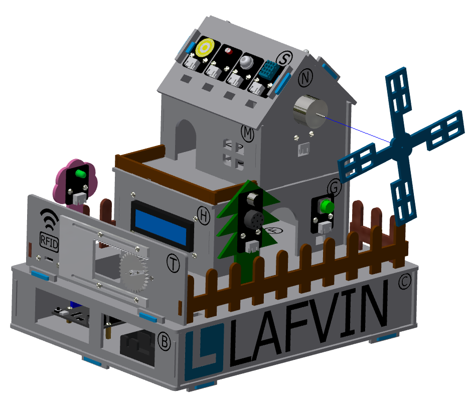

.. raw:: html

   

Step 3: Install the debug window cover
~~~~~~~~~~~~~~~~~~~~~~~~~~~~~~~~~~~~~~
Parts list: debug window cover、 latch with logo.

The installation is shown in the following figure:

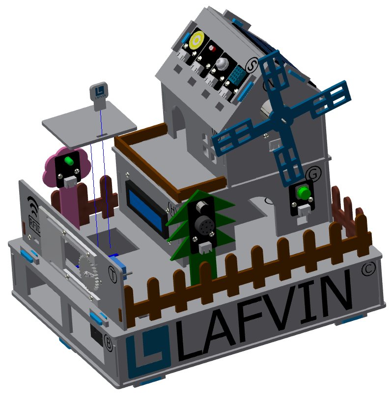

.. raw:: html

   

   
.. admonition:: Precautions

 - This cover is convenient for daily device debugging, wiring inspection, and development board status inspection.

----
