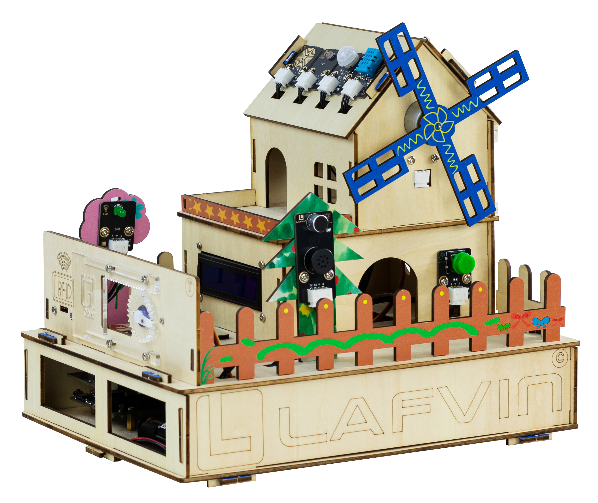

Introduction
============

**Welcome to ESP32-IOT-SmartHome-kit**

----

*This smart home development kit, built around the ESP32-DevKit development board, utilizes 2.54 standard interface components for connectivity. Users can control home devices manually, through voice recognition, or through a mobile app, enabling a variety of smart home functions, including door and window openings, light adjustment, RGB ambient lighting, and fan control. Through programming and app-based remote control, users can experience the joy of IoT control and understand the collaborative working principles of sensors and actuators.*

----

Bill of Materials
-----------------

The following table lists all components included in the **ESP32-IOT-SmartHome-kit**. Please check carefully to ensure that all parts are complete before starting.  

.. list-table::
   :header-rows: 1
   :widths: 30 40 20
   :align: center

   * - PIC
     - Item
     - Quantity
   * - .. image:: _static/bom/1.esp32.png
        :width: 200
        :align: center
     - ESP32 DevKit
     - 1 pcs
   * - .. image:: _static/bom/2.esp32expboard.png
        :width: 200
        :align: center
     - ESP32 Expansion Board
     - 1 pcs
   * - .. image:: _static/bom/3.battery.png
        :width: 200
        :align: center
     - Battery Box
     - 1 pcs
   * - .. image:: _static/bom/4.dht11.png
        :width: 100
        :align: center
     - DHT11 Sensor
     - 1 pcs
   * - .. image:: _static/bom/5.pir.png
        :width: 100
        :align: center
     - PIR Sensor
     - 1 pcs
   * - .. image:: _static/bom/6.rain.png
        :width: 100
        :align: center
     - Raindrop Sensor
     - 1 pcs
   * - .. image:: _static/bom/7.light.png
        :width: 100
        :align: center
     - Light Sensor
     - 1 pcs
   * - .. image:: _static/bom/8.led.png
        :width: 100
        :align: center
     - LED Module
     - 1 pcs
   * - .. image:: _static/bom/9.button.png
        :width: 100
        :align: center
     - Button Module
     - 1 pcs
   * - .. image:: _static/bom/10.fan.png
        :width: 100
        :align: center
     - Motor Fan Module
     - 1 pcs
   * - .. image:: _static/bom/11.speech.png
        :width: 100
        :align: center
     - Speech Recognition Module
     - 1 pcs
   * - .. image:: _static/bom/12.rgb1.png
        :width: 400
        :align: center
     - RGB Light Strip
     - 1 pcs
   * - .. image:: _static/bom/13.lcd.png
        :width: 200
        :align: center
     - LCD1602 Display
     - 1 pcs
   * - .. image:: _static/bom/14.rfid2.png
        :width: 200
        :align: center
     - RFID Module + IC Card
     - 1 set
   * - .. image:: _static/bom/15.servo.png
        :width: 200
        :align: center
     - SG90 Servo
     - 2 pcs
   * - .. image:: _static/bom/21.tyn.png
        :width: 200
        :align: center
     - Solar module
     - 1 pcs
   * - .. image:: _static/bom/16.typec.png
        :width: 200
        :align: center
     - Type-C Data Cable
     - 1 pcs
   * - .. image:: _static/bom/17.3p.png
        :width: 200
        :align: center
     - 3P Cable
     - 9 pcs
   * - .. image:: _static/bom/18.4p.png
        :width: 200
        :align: center
     - 4P Cable
     - 4 pcs
   * - .. image:: _static/bom/26.basswood.png
        :width: 100
        :align: center
     - Basswood Board
     - 6 pcs
   * - .. image:: _static/bom/22.caiban.png
        :width: 100
        :align: center
     - Painted Basswood
     - 1 pcs
   * - .. image:: _static/bom/24.acrylic.png
        :width: 100
        :align: center
     - Acrylic Sheet
     - 1 pcs
   * - .. image:: _static/bom/19.Gasket.png
        :width: 80
        :align: center
     - Gasket
     - 12 pcs
   * - .. image:: _static/bom/20.Screwdriver.png
        :width: 200
        :align: center
     - Phillips Screwdriver
     - 1 pcs
   * - .. image:: _static/bom/21.sleeve.png
        :width: 200
        :align: center
     - Sleeve
     - 5 pcs
   * - .. image:: _static/bom/23.screwbag.png
        :width: 300
        :align: center
     - Screw Bag
     - 3 bags
   * - .. image:: _static/bom/25.glue.png
        :width: 200
        :align: center
     - Glue
     - 5 pcs

----

Function Display
----------------

 - DHT11: Real-time temperature and humidity monitoring

 - Light sensor and rain sensor: Automatic light and window control

 - PIR motion sensor: Human detection and scene triggering

 - RFID card swipe module: Door unlocking with a card swipe

 - SPEECH recognition module: Voice control of lights, fans, and RGB light strips

 - LCD1602 display: Real-time display of sensor data and system status

 - RGB light strip: Colorful lighting effects

 - Servo: Simulate door and window switches

 - LED and Fan: Lighting and temperature control

（此处会插入一段功能展示的视频）

----
