The  Kit Course Learning
========================

 - This kit not only provides you with a complete course curriculum but also guides you through a step-by-step in-depth study of the fundamentals and applications of the Internet of Things. 
 - In this section, we'll individually introduce each component and functional module included in the kit, from basic sensors and actuators to communication modules, to help you systematically understand their functions and usage. 
 - By studying the working principles of these components, you'll not only master how to connect and control modules in real-world projects, but also gain a deeper understanding of how IoT systems achieve environmental perception, intelligent linkage, and remote operation. 
 - This will lay a solid foundation for your subsequent experiments, course design, and IoT project development, allowing you to better grasp the core knowledge of smart hardware and the Internet of Things.
 - Click this link to download all the example code provided with this kit. `Download sample code <https://www.dropbox.com/scl/fo/syf1zstu58f4xlcld2nss/ACJOi93PcIafo5yGabrprDA?rlkey=hoc2undykymrxac7z8nclpk9u&st=el86zaw9&dl=1>`_  

.. note::
  The following courses all come with sample code. You have two options for flashing the code:
 - Option 1: If you choose to flash the code using the Arduino IDE, click here to jump to the Arduino IDE flashing tutorial. :ref:`Arduino IDE burning program`

 - Option 1: If you choose to flash the code using Espressif's official flashing tool, click here to jump to the official flashing tool flashing tutorial. :ref:`Direct Burn Program`

----

Course 1：LED Module-Breathing Light
-----------------------------------

**Working principle:** 

 - LED (Light Emitting Diode) is a semiconductor device that can emit light. When a forward voltage is applied, the LED conducts in a single direction and emits light. By controlling the high and low levels of the circuit it is connected to, it can be turned on or off.

**wiring:** 

 - LED Module → ESP32 IO26

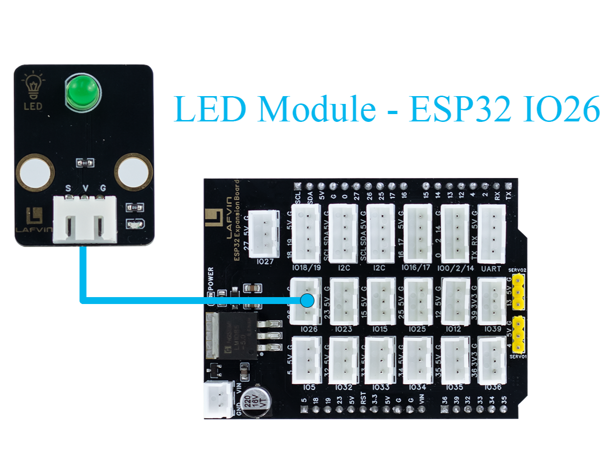

**Sample Code:**

.. code-block:: cpp

   #include <Arduino.h>
   const int ledPin = 26;   // LED PIN
   const uint32_t freq = 5000;
   const uint8_t resolution = 8;  // 0-255
   void setup() {
     Serial.begin(115200);
     Serial.println("breathing light");

     ledcAttach(ledPin, freq, resolution);
   }

   void loop() {
     // Bright
     for (int duty = 0; duty <= 255; duty++) {
       ledcWrite(ledPin, duty);
       delay(10);
     }

     // dark
     for (int duty = 255; duty >= 0; duty--) {
       ledcWrite(ledPin, duty);
       delay(10);
     }
   }

----

**Code burning options**

 - You can directly copy the code provided above into the Arduino IDE for burning.
 - Find the **1.BreathingLight.ino** file in the provided folder, download it, open it with the Arduino IDE, and burn the program to the ESP32 development board.
 - Find the **1.BreathingLight.bin** file in the provided folder, download it and use Espressif's official flashing tool to flash the program to the ESP32 development board.

**Effect display:**

 - The LED light will change from bright to dark and then back to bright, similar to the breathing effect.
 - The speed of change can be changed by adjusting the value of **delay(10)**.

----

Course 2：Light Sensor-Brightness Detection
----------------------

**Working principle:** 

 - Light intensity affects the resistance or current of the sensor element. After internal voltage division, an analog voltage output is generated. The ESP32 reads the voltage value through the ADC and can calculate the current ambient brightness.

**wiring:** 

 - Light Sensor → ESP32 IO34

.. image:: _static/COURSE/2.light.png
   :width: 600
   :align: center

**Sample Code:**

.. code-block:: cpp

   #include <Arduino.h>

   // Define sensor pin
   const int lightSensorPin = 34;  // S pin connected to GPIO34 (ADC input)

   void setup() {
       Serial.begin(115200);
       delay(1000);
       Serial.println("Light Sensor Test Started");
   }

   void loop() {
       int sensorValue = analogRead(lightSensorPin);
       float brightnessPercent = sensorValue * 100.0 / 4095.0;
       Serial.print("ADC Value: ");
       Serial.print(sensorValue);
       Serial.print("  |  Brightness: ");
       Serial.print(brightnessPercent);
       Serial.println("%");
       delay(3000);
   }

----

**Code burning options**

 - You can directly copy the code provided above into the Arduino IDE for burning.
 - Find the **2.BrightnessDetection.ino** file in the provided folder, download it, open it with the Arduino IDE, and burn the program to the ESP32 development board.
 - Find the **2.BrightnessDetection.bin** file in the provided folder, download it and use Espressif's official flashing tool to flash the program to the ESP32 development board.

**Effect display:**

 - The surrounding brightness data will be output every 3 seconds on the **serial monito**

.. image:: _static/2/2.light.png
   :width: 600
   :align: center

.. raw:: html

   

.. note::

   - If you see garbled or abnormal display in the **serial monitor**, please check and confirm that the baud rate is set to **115200 baud**. 
   - All sample codes provided by this kit use the baud rate of **115200 baud** by default.
   
   .. image:: _static/2/6.baud.png
      :width: 600
      :align: center

----

Course 3：PIR Sensor-Human Body Detection
----------------------------------------

**Working principle:** 

 - Pyroelectric chips sense infrared heat radiated by the human body. 
 - When a person moves into the sensing area, the temperature on both sides of the chip changes, generating a charge change that outputs a voltage signal. 
 - The sensor's internal circuitry amplifies the signal and reshapes it into digital high and low levels. 
 - High indicates a person is present. Low indicates no person is present.

**wiring:** 

 - PIR Sensor → ESP32 IO33

.. image:: _static/COURSE/3.pir.png
   :width: 600
   :align: center

**Sample Code:**

.. code-block:: cpp

   #include <Arduino.h>

   // Define PIR sensor pin
   const int pirPin = 33;  // Signal pin connected to GPIO33

   void setup() {
       // Initialize serial communication at 115200 baud
       Serial.begin(115200);
       delay(1000); // Give time for Serial Monitor to start

       // Set PIR pin as input
       pinMode(pirPin, INPUT);

       Serial.println("PIR Sensor Test Started");
   }

   void loop() {
       // Read PIR sensor digital value
       int motionDetected = digitalRead(pirPin);

       if (motionDetected == HIGH) {
           // Motion detected
           Serial.println("Motion Detected!");
       } else {
           // No motion
           Serial.println("No Motion");
       }

       // Wait 3000 milliseconds before next reading
       delay(3000);
   }

----

**Code burning options**

 - You can directly copy the code provided above into the Arduino IDE for burning.
 - Find the **3.HumanBodyDetection.ino** file in the provided folder, download it, open it with the Arduino IDE, and burn the program to the ESP32 development board.
 - Find the **3.HumanBodyDetection.bin** file in the provided folder, download it and use Espressif's official flashing tool to flash the program to the ESP32 development board.

**Effect display:**

**Effect display:**

 - When the PIR sensor detects human movement, the blue indicator light will turn on.
 - The **serial monitor** will output whether a human body is detected.

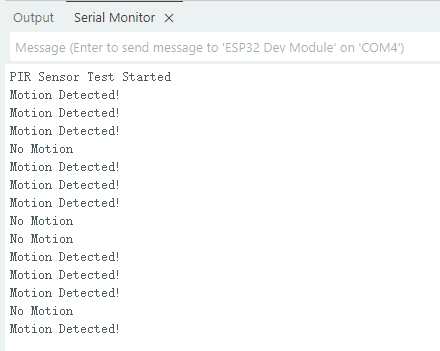

----

Course 4：Raindrop Sensor-Raindrop Detection
--------------------------------------------

**Working principle:** 

 - When water droplets land on the electrode plates, they create conduction or change resistance. The sensor converts this change in conductance/resistance into a voltage signal. Outputs can be:
 - Digital signal: HIGH indicates a water droplet is detected, LOW indicates no water droplets.
 - Analog signal: The voltage value changes with the amount of water droplets.

**wiring:** 

 - Raindrop Sensor → ESP32 IO35

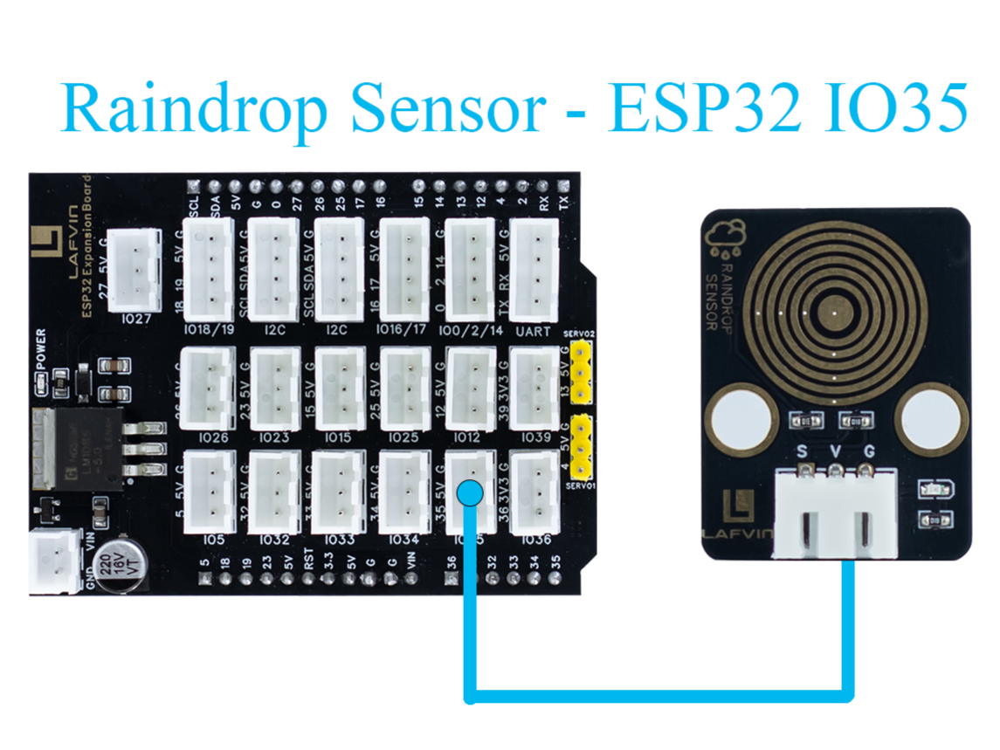

**Sample Code:**

.. code-block:: cpp

   #include <Arduino.h>

   // Define rain sensor pin
   const int rainSensorPin = 35;  // S pin connected to GPIO35

   void setup() {
       // Initialize serial communication at 115200 baud
       Serial.begin(115200);
       delay(1000);  // Give time for Serial Monitor to start

       // Set rain sensor pin as input
       pinMode(rainSensorPin, INPUT);

       Serial.println("Rain Sensor Test Started");
   }

   void loop() {
       // Read digital value from rain sensor
       int rainDetected = digitalRead(rainSensorPin);

       if (rainDetected == HIGH) {
           // Rain detected
           Serial.println("Rain Detected!");
       } else {
           // No rain
           Serial.println("No Rain");
       }

       // Delay 3000 milliseconds before next reading
       delay(3000);
   }

----

**Code burning options**

 - You can directly copy the code provided above into the Arduino IDE for burning.
 - Find the **4.RaindropDetection.ino** file in the provided folder, download it, open it with the Arduino IDE, and burn the program to the ESP32 development board.
 - Find the **4.RaindropDetection.bin** file in the provided folder, download it and use Espressif's official flashing tool to flash the program to the ESP32 development board. 

**Effect display:**

 - When the electrodes of the raindrop sensor detect rain, the **serial monitor** will output "Rain Detected!"

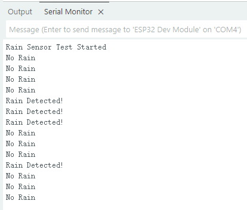

----

Course 5：DHT11 Sensor+Fan Module-Temperature controlled fan
------------------------------------------------------------
**Working principle:** 

*DHT11 Sensor*
 - Temperature Sensing: An integrated NTC thermistor measures the ambient temperature by measuring the change in resistance with temperature.
 - Humidity Sensing: A capacitive humidity sensor is used. The dielectric constant of the capacitor changes with air humidity, thus providing relative humidity.
 - Signal Processing: An internal 8-bit microcontroller converts the analog temperature and humidity signals into digital signals, which are then transmitted to the main control unit via a single-wire bus protocol.

*FAN Module*
 - The core is a DC motor. When the signal (S) is high, the fan is powered on.
 - Current flows through the motor coil, generating a magnetic field that rotates the motor and the blades.
 - When the signal is off, the circuit is de-energized, and the fan stops.

**wiring:** 

 - DHT11 Sensor → ESP32 IO15
 - FAN Module → ESP32 IO27

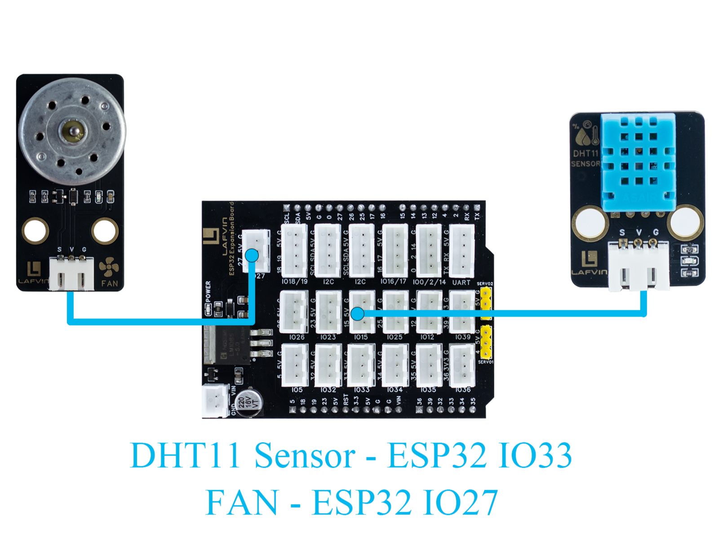

**Sample Code:**

.. code-block:: cpp

   #include <DHT.h>

   #define DHTPIN 15       // DHT11 signal pin connected to ESP32 GPIO15
   #define DHTTYPE DHT11   // Define sensor type as DHT11

   #define FAN_PIN 27      // Fan signal pin connected to ESP32 GPIO27
   #define TEMP_THRESHOLD 30  // Temperature threshold to turn on fan

   DHT dht(DHTPIN, DHTTYPE);

   void setup() {
       Serial.begin(115200);
       dht.begin();

       pinMode(FAN_PIN, OUTPUT);
       digitalWrite(FAN_PIN, LOW); // Fan initially OFF

       Serial.println("DHT11 Sensor + Fan Control Example");
   }

   void loop() {
       // Read temperature and humidity
       float h = dht.readHumidity();
       float t = dht.readTemperature();

       // Check if reading failed
       if (isnan(h) || isnan(t)) {
           Serial.println("Failed to read from DHT11 sensor!");
           delay(3000);
           return;
       }

       // Print sensor data
       Serial.print("Humidity: ");
       Serial.print(h);
       Serial.print(" %  |  Temperature: ");
       Serial.print(t);
       Serial.println(" °C");

       // Control fan based on temperature
       if (t >= TEMP_THRESHOLD) {
           digitalWrite(FAN_PIN, HIGH);  // Turn ON fan
           Serial.println("Temperature >= 30°C → Fan ON");
       } else {
           digitalWrite(FAN_PIN, LOW);   // Turn OFF fan
           Serial.println("Temperature < 30°C → Fan OFF");
       }

       Serial.println("-----------------------------");

       delay(3000);  // Wait 3 seconds before next reading
   }

----

**Code burning options**

 - You can directly copy the code provided above into the Arduino IDE for burning.
 - Find the **5.DHT11FAN.ino** file in the provided folder, download it, open it with the Arduino IDE, and burn the program to the ESP32 development board.
 - Find the **5.DHT11FAN.bin** file in the provided folder, download it and use Espressif's official flashing tool to flash the program to the ESP32 development board. 

**Effect display:**

 - The **serial monitor** outputs the ambient temperature and humidity every 3 seconds. When the temperature reaches 30 degrees, the fan will start to rotate.

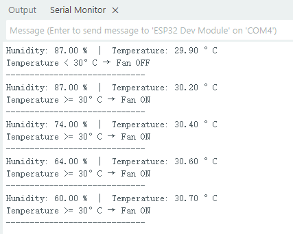

----

Course 6：LCD1602 Screen-Environmental Status Display
-----------------------------------------------------
**Working principle:** 

*LCD1602 Screen*
 - LCD1602 is a character liquid crystal display that can display 2 rows*16 columns of characters. The display or non-display of pixels is controlled by voltage signals.

**wiring:** 

 - LCD1602 Screen → ESP32 I2C
 - DHT11 Sensor → ESP32 IO15
 - LIGHT Sensor → ESP32 IO34
 - Raindrop Sensor → ESP32 IO35

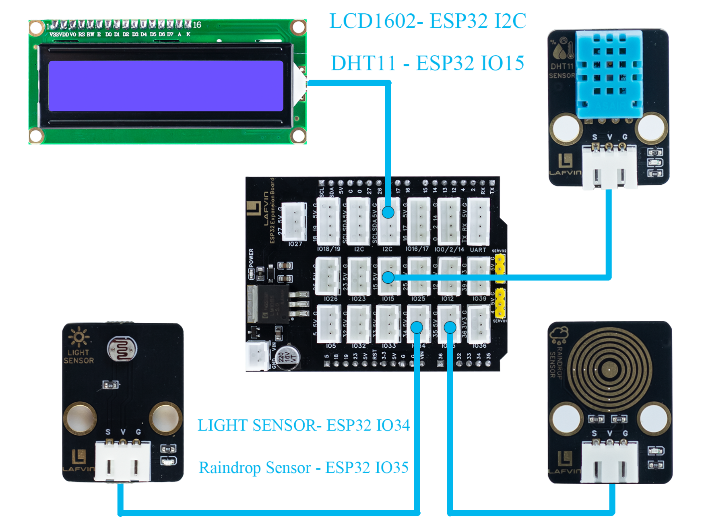

**Sample Code:**

.. code-block:: cpp

   #include <Wire.h>
   #include <LiquidCrystal_I2C.h>
   #include <DHT.h>

   // ====== DHT11 Sensor ======
   #define DHTPIN 15
   #define DHTTYPE DHT11
   DHT dht(DHTPIN, DHTTYPE);

   // ====== Rain and Light Sensors ======
   #define RAIN_PIN 35  // Rain sensor analog pin
   #define LIGHT_PIN 34 // Light sensor analog pin

   // ====== LCD ======
   #define LCD_ADDR 0x27 // I2C address of LCD1602, change if needed
   LiquidCrystal_I2C lcd(LCD_ADDR, 16, 2);

   // ====== Helper function to map analog to 0-100 ======
   int normalizeValue(int value, int minVal = 0, int maxVal = 4095) {
       int normalized = map(value, minVal, maxVal, 0, 100);
       if (normalized < 0) normalized = 0;
       if (normalized > 100) normalized = 100;
       return normalized;
   }

   void setup() {
       Serial.begin(115200);
       
       // Initialize DHT11
       dht.begin();
       
       // Initialize LCD
       lcd.init();
       lcd.backlight();
       lcd.clear();
       lcd.setCursor(0, 0);
       lcd.print("Initializing...");
       
       delay(2000);
   }

   void loop() {
       // ====== Read Sensors ======
       float temp = dht.readTemperature();  // Celsius
       float humi = dht.readHumidity();

       int rainRaw = analogRead(RAIN_PIN);  // 0-4095
       int lightRaw = analogRead(LIGHT_PIN);

       // Normalize rain and light to 0-100
       int rainValue = normalizeValue(rainRaw);
       int lightValue = normalizeValue(lightRaw);

       // ====== Serial Output ======
       Serial.print("Temp: "); Serial.print(temp); Serial.print(" C  ");
       Serial.print("Humi: "); Serial.print(humi); Serial.print(" %  ");
       Serial.print("Rain: "); Serial.print(rainValue); Serial.print("  ");
       Serial.print("Light: "); Serial.println(lightValue);

       // ====== LCD Display ======
       lcd.clear();  // Clear previous content

       // First row: Temperature and Humidity
       lcd.setCursor(0, 0);
       lcd.print("TEMP:");
       if (!isnan(temp)) lcd.print((int)temp); else lcd.print("--");
       lcd.print(" HUMI:");
       if (!isnan(humi)) lcd.print((int)humi); else lcd.print("--");

       // Second row: Rain and Light
       lcd.setCursor(0, 1);
       lcd.print("RAIN:");
       lcd.print(rainValue);
       lcd.print("  LIGHT:");
       lcd.print(lightValue);

       delay(3000); // Update every 3 seconds
   }

----

**Code burning options**

 - You can directly copy the code provided above into the Arduino IDE for burning.
 - Find the **6.EnvironmentalDisplay.ino** file in the provided folder, download it, open it with the Arduino IDE, and burn the program to the ESP32 development board.
 - Find the **6.EnvironmentalDisplay.bin** file in the provided folder, download it and use Espressif's official flashing tool to flash the program to the ESP32 development board. 

**Effect display:**

 - The LCD1602 screen will display two lines of information. The first line displays the temperature and humidity values, and the second line displays the raindrop value and brightness value.

----

Course 7：RFID Module+SG90 Servo-Card access control system
-----------------------------------------------------------
**Working principle:** 

*RFID Module*
 - The RFID module generates a radio frequency electromagnetic field through its antenna. When a chip attached to an RFID card (or tag) enters the sensing area, the coil in the chip senses the electromagnetic field and draws energy.
 - The card chip uses modulation and demodulation techniques to transmit its stored unique ID data to the RFID module.
 - The RFID module then transmits this data to the microcontroller via the I²C interface.

*SG90 Servo*
 - The SG90 is a small PWM-controlled servo with a pulse-width modulated (PWM) input signal.
 - The control signal period is fixed at 20ms (50Hz):
 - Pulse width of approximately 0.5ms → servo rotates to 0°
 - Pulse width of approximately 1.5ms → servo rotates to 90°
 - Pulse width of approximately 2.5ms → servo rotates to 180°
 - Internally, it consists of a DC motor, a reduction gear, and a potentiometer for feedback. The potentiometer monitors the servo position in real time, and the circuit automatically adjusts the motor rotation to maintain the servo at the target angle.

**wiring:** 

 - RFID Module → ESP32 I2C
 - SG90 Servo  → ESP32 IO13（servo2）

.. image:: _static/COURSE/7.RFID.png
   :width: 600
   :align: center

**Sample Code:**

.. code-block:: cpp

   #include <Wire.h>
   #include <MFRC522_I2C.h>
   #include <ESP32Servo.h>

   #define RC522_ADDR 0x28      // I2C address (need to confirm)
   #define I2C_SDA 21
   #define I2C_SCL 22

   #define SERVO_PIN 13         // Servo signal pin connected to ESP32 GPIO13
   #define OPEN_ANGLE 90        // Servo angle for door open
   #define CLOSE_ANGLE 0        // Servo angle for door close
   #define OPEN_TIME 3000       // Door open duration (milliseconds)

   MFRC522_I2C mfrc522(RC522_ADDR, 0xFF);  
   Servo doorServo;

   void setup() {
       Serial.begin(115200);
       Wire.begin(I2C_SDA, I2C_SCL);
       mfrc522.PCD_Init();  // Initialize RC522
       Serial.println("Initialization complete, waiting for card...");

       doorServo.setPeriodHertz(50);              // Set to standard servo frequency
       doorServo.attach(SERVO_PIN, 500, 2400);    // Limit pulse width range to avoid jitter
       doorServo.write(CLOSE_ANGLE);              // Initial state: door closed
   }

   void loop() {
       if (!mfrc522.PICC_IsNewCardPresent() || !mfrc522.PICC_ReadCardSerial()) {
           delay(100);
           return;
       }

       Serial.print("Card UID: ");
       for (byte i = 0; i < mfrc522.uid.size; i++) {
           if (mfrc522.uid.uidByte[i] < 0x10) Serial.print("0");
           Serial.print(mfrc522.uid.uidByte[i], HEX);
           Serial.print(" ");
       }
       Serial.println();

       // === Door open action ===
       Serial.println("✅ Card detected, opening door...");
       openDoor();

       mfrc522.PICC_HaltA();
       mfrc522.PCD_StopCrypto1();
       delay(1000);  // Prevent reading the same card too quickly
   }

   void openDoor() {
       doorServo.write(OPEN_ANGLE);
       delay(OPEN_TIME);
       doorServo.write(CLOSE_ANGLE);
   }

----

**Code burning options**

 - You can directly copy the code provided above into the Arduino IDE for burning.
 - Find the **7.RFIDDOOR.ino** file in the provided folder, download it, open it with the Arduino IDE, and burn the program to the ESP32 development board.
 - Find the **7.RFIDDOOR.bin** file in the provided folder, download it and use Espressif's official flashing tool to flash the program to the ESP32 development board. 
**Effect display:**

 - When the ID card is close to the RFID module, the servo will rotate to simulate the door opening action. At the same time, the serial monitor will display the read card number and prompt "Door opened successfully".

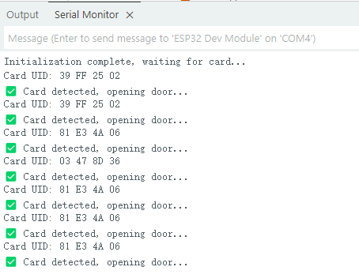

----

Course 8：Button Module+RGB Light Strip-Ambient Lighting
--------------------------------------------------------
**Working principle:** 

*Button Module*
 - When a key is not pressed, the S terminal is normally connected to a high level （through a pull-up resistor or internal pull-up）, and the digital reading is HIGH.
 - When a key is pressed, the S terminal is connected to GND, and the digital reading is LOW.
 - The ESP32 detects whether a key is "pressed" or "released" by reading the level change on the S terminal.

*RGB Light Strip*
 - Each LED consists of three small lights （red, green, and blue）, whose brightness can be adjusted to create various colors.
 - The ESP32 sends control data via a single digital signal （with strict timing, typically using a specialized library such as Adafruit_NeoPixel）.
 - The data format is the RGB brightness value of each LED, which is transmitted to each LED in sequence. After the first LED receives its data, it forwards the subsequent data to the next LED.
 - By continuously refreshing the data, dynamic effects such as color gradients, blinking, and flowing can be achieved.

**wiring:** 

 - Button Module → ESP32 IO32
 - RGB Light Strip  → ESP32 IO5

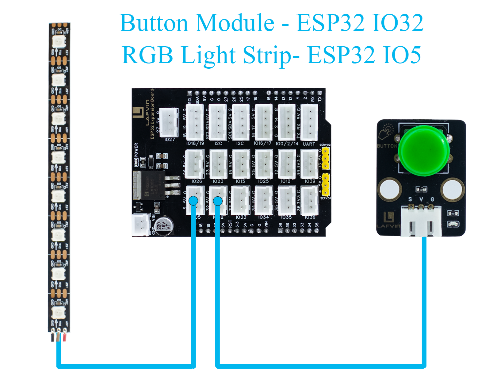

**Sample Code:**

.. code-block:: cpp

   #include <Arduino.h>
   #include <Adafruit_NeoPixel.h>

   // RGB LED strip configuration
   #define WS2812_PIN 5       // RGB LED data pin
   #define WS2812_NUM 8       // Number of LEDs

   // Button configuration
   #define BUTTON_PIN 32

   // RGB control variables
   Adafruit_NeoPixel pixels(WS2812_NUM, WS2812_PIN, NEO_GRB + NEO_KHZ800);
   int oldButtonLevel = HIGH;   // Previous button state
   bool rgbAutoMode = false;    // Whether RGB effect is active
   int colorMode = 0;           // 0=Rainbow, 1=Fire, 2=Lightning, 3=Starry

   // Timing for RGB effect
   unsigned long lastColorChange = 0;
   int colorSpeed = 30;  // Speed in ms
   int hue = 0;

   void setup() {
       Serial.begin(115200);
       pinMode(BUTTON_PIN, INPUT_PULLUP); // Configure button as input with pullup
       pixels.begin();                     // Initialize RGB strip
       pixels.show();                      // Turn off all LEDs initially
       Serial.println("RGB Button Control Ready");
   }

   // Simple rainbow effect
   void rainbowEffect() {
       hue += 8;
       if (hue >= 65536) hue = 0;

       for (int i = 0; i < WS2812_NUM; i++) {
           int pixelHue = hue + (i * 65536L / WS2812_NUM);
           pixels.setPixelColor(i, pixels.gamma32(pixels.ColorHSV(pixelHue)));
       }
       pixels.show();
   }

   // Fire effect
   void fireEffect() {
       for (int i = 0; i < WS2812_NUM; i++) {
           int flicker = random(0, 150);
           int r = 255;
           int g = random(50, 150);
           int b = random(0, 50);
           pixels.setPixelColor(i, pixels.Color(r - flicker, g - flicker, b));
       }
       pixels.show();
   }

   // Lightning effect
   void lightningEffect() {
       if (random(0, 100) > 95) {
           int flashes = random(1, 4);
           for (int f = 0; f < flashes; f++) {
               for (int i = 0; i < WS2812_NUM; i++) pixels.setPixelColor(i, pixels.Color(255, 255, 255));
               pixels.show();
               delay(random(10, 50));
               for (int i = 0; i < WS2812_NUM; i++) pixels.setPixelColor(i, pixels.Color(0, 0, 0));
               pixels.show();
               delay(random(5, 30));
           }
       }
       // Slight glow background
       for (int i = 0; i < WS2812_NUM; i++) {
           int glow = random(0, 30);
           pixels.setPixelColor(i, pixels.Color(glow, glow, glow + random(0, 20)));
       }
       pixels.show();
   }

   // Starry night effect
   void starryNightEffect() {
       pixels.clear();
       for (int i = 0; i < random(2, 5); i++) {
           int pos = random(WS2812_NUM);
           int brightness = random(100, 255);
           int color = random(0, 3);
           switch(color) {
               case 0: pixels.setPixelColor(pos, pixels.Color(brightness, 0, 0)); break;
               case 1: pixels.setPixelColor(pos, pixels.Color(0, brightness, 0)); break;
               case 2: pixels.setPixelColor(pos, pixels.Color(0, 0, brightness)); break;
           }
       }
       pixels.show();
   }

   // Update RGB effects based on current mode
   void updateRGBEffects() {
       unsigned long currentMillis = millis();
       if (currentMillis - lastColorChange >= colorSpeed) {
           lastColorChange = currentMillis;
           switch(colorMode) {
               case 0: rainbowEffect(); break;
               case 1: fireEffect(); break;
               case 2: lightningEffect(); break;
               case 3: starryNightEffect(); break;
           }
       }
   }

   // Handle button press to switch RGB modes
   void buttonPressLoop() {
       int buttonLevel = digitalRead(BUTTON_PIN);
       
       // Detect button press (falling edge)
       if (buttonLevel == LOW && oldButtonLevel == HIGH) {
           if (!rgbAutoMode) {
               colorMode = (colorMode + 1) % 4; // Cycle through 4 effects
               rgbAutoMode = true;
               Serial.print("RGB Mode Activated: ");
               switch(colorMode) {
                   case 0: Serial.println("Rainbow"); break;
                   case 1: Serial.println("Fire"); break;
                   case 2: Serial.println("Lightning"); break;
                   case 3: Serial.println("Starry Night"); break;
               }
           } else {
               rgbAutoMode = false;
               pixels.clear();
               pixels.show();
               Serial.println("RGB Mode Deactivated");
           }
           delay(200); // Debounce delay
       }
       
       oldButtonLevel = buttonLevel;
   }

   void loop() {
       buttonPressLoop();
       
       if (rgbAutoMode) {
           updateRGBEffects();
       }
       
       delay(10);
   }

----

**Code burning options**

 - You can directly copy the code provided above into the Arduino IDE for burning.
 - Find the **8.RGBLIGHT.ino** file in the provided folder, download it, open it with the Arduino IDE, and burn the program to the ESP32 development board.
 - Find the **8.RGBLIGHT.bin** file in the provided folder, download it and use Espressif's official flashing tool to flash the program to the ESP32 development board. 

 **Effect display:**

 - Pressing the button toggles between four RGB effects: Rainbow, Fire, Lightning, and Starry Night.
 - Pressing the button again turns off the RGB light strip.
 - The serial monitor will display the current mode or a shutdown prompt.

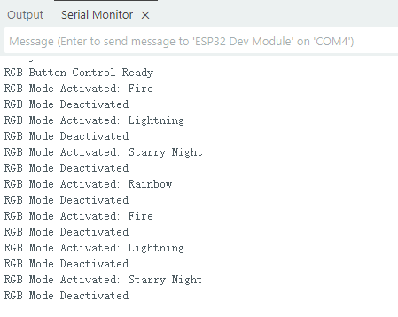

----

Course 9：Speech Recognition Module-Voice-Controlled Light
----------------------------------------------------------
**Working principle:** 

*Speech Recognition Module*
 - The module contains a microphone for collecting external sound signals.
 - Sound signals are analog and need to be converted to digital signals using an analog-to-digital converter (ADC).
 - The module processes the collected sound and extracts key speech features (such as syllables, frequency, and amplitude variations).
 - Once a command is recognized, the module transmits the recognition result to a main control chip such as the ESP32 via a serial port signal. The ESP32 then performs the corresponding operation based on the received command.
 - For example, in this sample code, the data sent "0x03" means turning on the light, and "0x04" means turning off the light.

**wiring:** 

 - Speech Recognition Module → ESP32 IO16、17
 - LED Module → ESP32 IO26

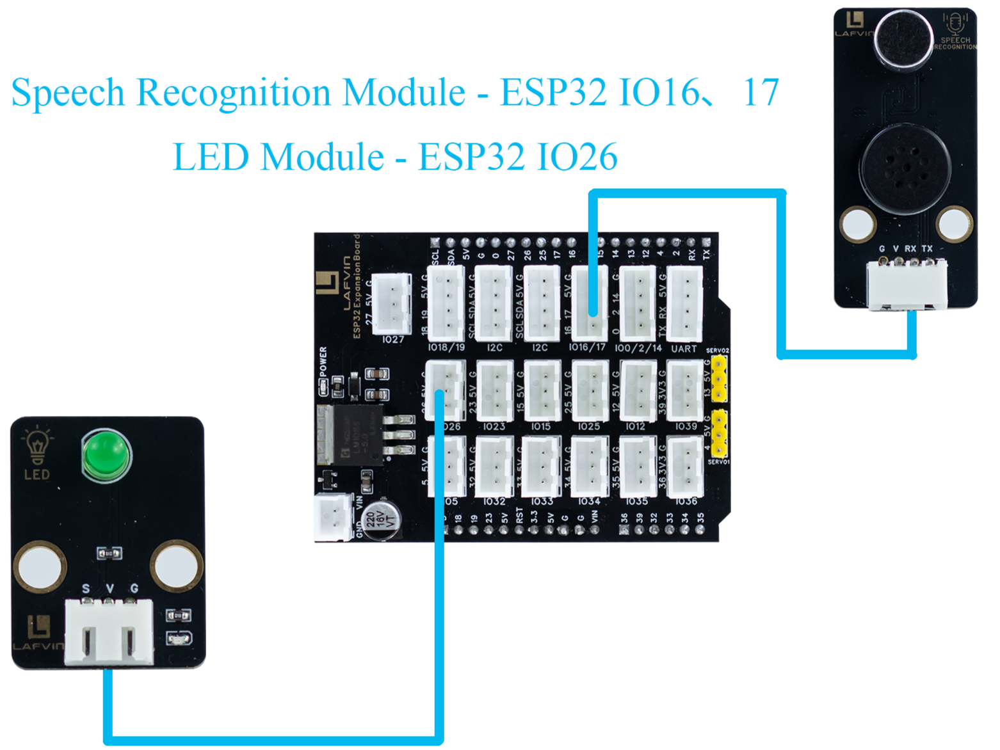

**Sample Code:**

.. code-block:: cpp

   #include <Arduino.h>

   // LED configuration
   #define LED_PIN 26

   // Voice recognition
   #define VOICE_RX_PIN 16
   #define VOICE_TX_PIN 17
   #define VOICE_HEADER 0xAA          // Packet header
   #define VOICE_FOOTER 0xBB          // Packet footer
   #define VOICE_PACKET_LENGTH 3      // Packet length
   #define VOICE_KEY_LED_ON 0x03
   #define VOICE_KEY_LED_OFF 0x04

   HardwareSerial VoiceSerial(2);

   // Voice protocol parsing variables
   uint8_t voiceBuffer[VOICE_PACKET_LENGTH];
   int voiceBufferIndex = 0;
   bool voiceReceiving = false;
   unsigned long lastVoiceByteTime = 0;
   const unsigned long VOICE_TIMEOUT = 100; // Byte timeout in ms

   void setLedValue(int val) {
     digitalWrite(LED_PIN, val);
   }

   int getLedValue() {
     return digitalRead(LED_PIN);
   }

   // Validate command
   bool isValidVoiceCommand(uint8_t command) {
     return (command == VOICE_KEY_LED_ON || command == VOICE_KEY_LED_OFF);
   }

   // Process voice command
   void processVoiceCommand(uint8_t keyword) {
     if (keyword == VOICE_KEY_LED_ON) {
       setLedValue(HIGH);
       Serial.println("Voice Command: LED ON");
     } else if (keyword == VOICE_KEY_LED_OFF) {
       setLedValue(LOW);
       Serial.println("Voice Command: LED OFF");
     }
   }

   // Voice protocol parser
   void voiceSerialLoop() {
     // Check timeout
     if (voiceReceiving && millis() - lastVoiceByteTime > VOICE_TIMEOUT) {
       voiceBufferIndex = 0;
       voiceReceiving = false;
     }
     
     while (VoiceSerial.available() > 0) {
       uint8_t data = VoiceSerial.read();
       lastVoiceByteTime = millis();
       
       if (!voiceReceiving) {
         if (data == VOICE_HEADER) {
           voiceReceiving = true;
           voiceBufferIndex = 0;
           voiceBuffer[voiceBufferIndex++] = data;
         }
         continue;
       }
       
       if (voiceBufferIndex < VOICE_PACKET_LENGTH) {
         voiceBuffer[voiceBufferIndex++] = data;
         
         if (voiceBufferIndex == VOICE_PACKET_LENGTH) {
           if (voiceBuffer[0] == VOICE_HEADER && voiceBuffer[2] == VOICE_FOOTER) {
             uint8_t keyword = voiceBuffer[1];
             if (isValidVoiceCommand(keyword)) {
               processVoiceCommand(keyword);
             } else {
               Serial.print("Invalid command: 0x");
               Serial.println(keyword, HEX);
             }
           }
           voiceReceiving = false;
           voiceBufferIndex = 0;
         }
       } else {
         voiceReceiving = false;
         voiceBufferIndex = 0;
       }
     }
   }

   void setup() {
     Serial.begin(115200);
     VoiceSerial.begin(115200, SERIAL_8N1, VOICE_TX_PIN, VOICE_RX_PIN);
     pinMode(LED_PIN, OUTPUT);
     setLedValue(LOW);
     Serial.println("Voice-controlled LED system started");
   }

   void loop() {
     voiceSerialLoop();  // Handle voice commands
   }

----

**Code burning options**

 - You can directly copy the code provided above into the Arduino IDE for burning.
 - Find the **9.Voicelight.ino** file in the provided folder, download it, open it with the Arduino IDE, and burn the program to the ESP32 development board.
 - Find the **9.Voicelight.bin** file in the provided folder, download it and use Espressif's official flashing tool to flash the program to the ESP32 development board. 

**Effect display:**

 - When you say **Turn on the ligh** or **Turn on the light** to the voice recognition module, the LED light module will turn on or off.

----
